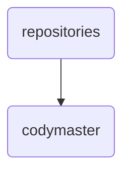

# Codymaster Identity

The 'codymaster' directory serves as the central repository for CodyMaster-related configurations and documentation within OmniClaw v5.0, ensuring consistent updates and maintenance across various languages.

---

## Topological View

---
*OmniClaw V5.0 | Forged by OMA AI Architect | brain.knowledge.repositories.codymaster | 2026-04-10*
