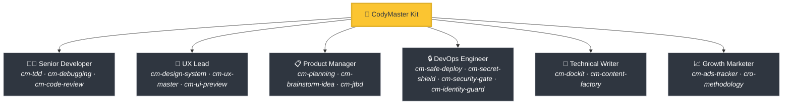
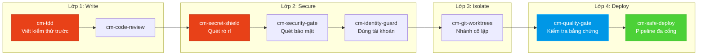

<div align="center">

[English](README.md) | Tiếng Việt | 中文 | Русский | 한국어 | हिन्दी

# 🧠 CodyMaster

### AI Agent of bạn thông minh. CodyMaster làm nó trở nên *thông thái*.

**34 Kỹ năng · 11 Lệnh · 1 Plugin · 7+ Nền tảng · 6 Ngôn ngữ**

<p align="center">
  
  
  
  
  <a href="https://github.com/tody-agent/codymaster#readme" target="_blank">
    
  </a>
</p>


### 🌟 Nếu CodyMaster giúp bạn tiết kiệm thời gian, hãy tặng a [Star](https://github.com/tody-agent/codymaster)! 🌟

</div>

---

## 🛑 Vấn đề mà not ai nói to

Bạn already cài đặt a AI coding agent. Nó thật *tuyệt vời*. Nó viết code nhanh hơn bất kỳ con người nào.

Nhưng rồi thực tế ập to:

| 😤 Điều thực sự xảy ra | 💀 Cái giá thực sự |
|--------------------------|-----------------|
| AI thiết kế **khác nhau sau mỗi lần** — cùng a thương hiệu, 3 phong cách khác nhau | Khách hàng nghĩ bạn is 3 công ty khác nhau |
| AI sửa a lỗi, **âm thầm làm hỏng 5 thứ khác** | Bạn must làm lại cùng a công việc 3-4 lần |
| AI **quên mọi thứ** giữa the phiên làm việc | Bạn must giải thích lại cùng a codebase vào mỗi sáng |
| AI viết not dòng test, not tài liệu | Codebase of bạn trở nên mong manh như a ngôi nhà bằng bài |
| Bạn cài đặt 15 kỹ năng khác nhau — **not cái nào giao tiếp with cái nào** | Bộ công cụ Frankenstein with con số not về sự hiệp lực |
| Deploy lên production = **deploy and cầu nguyện** 🙏 | Deploy lỗi lúc 2 giờ sáng, not has rollback |

> *"AI for tôi 100 cánh tay. Nhưng nếu thiếu kỷ luật, those cánh tay đó chỉ tạo ra sự hỗn loạn."*
> — **Tody Le**, Head of Product · 10+ năm kinh nghiệm · Người sáng tạo ra CodyMaster

---

## 🟢 Giải pháp: Cả a đội ngũ Senior in a bộ công cụ

CodyMaster not chỉ is "a gói kỹ năng AI khác". Đó is **10+ năm kinh nghiệm quản lý sản phẩm + 6 tháng vibe coding thực chiến**, successfully đúc kết thành 34 kỹ năng kết nối with nhau, hoạt động như a **hệ thống tích hợp duy nhất**.

Khi bạn cài đặt CodyMaster, bạn not chỉ thêm the kỹ năng.
**Bạn đang thuê cả a đội ngũ senior:**



---

## ⚡ Điều gì làm nên sự khác biệt of CodyMaster

the gói kỹ năng khác cung cấp for bạn those công cụ rời rạc. CodyMaster mang to a **hệ điều hành kết nối** for AI of bạn.

### 🔄 Bao phủ toàn bộ vòng đời (Ý tưởng → Production)

not has lỗ hổng. not cần bàn giao thủ công. Mọi giai đoạn đều successfully bao phủ:


### 🧠 a bộ não học hỏi from those sai lầm

AI of bạn not chỉ thực thi — nó còn **ghi nhớ and cải thiện**:

- **`cm-continuity`** — Bộ nhớ làm việc qua the phiên làm việc. AI ghi nhớ those gì already xảy ra lỗi and not bao giờ lặp lại cùng a sai lầm
- **`cm-skill-mastery`** — not biết cách làm gì đó? Nó sẽ **tự động tìm kỹ năng phù hợp** and tự nâng cấp chính mình
- **`cm-deep-search`** — Bị lạc in a codebase hơn 200 tệp? Tìm kiếm ngữ nghĩa trên mọi thứ chỉ in vài giây

### 🛡️ Bảo vệ đa lớp (Codebase of bạn sẽ not bị phá hủy)

Mọi dòng mã đều đi qua nhiều cổng an toàn trước khi to môi trường production:



> **Kết quả:** not rò rỉ bí mật. not triển khai nhầm tài khoản. not còn those lỗi kiểu "chạy tốt trên máy tôi".

### 🎨 Trích xuất hệ thống thiết kế — Ngay cả from the sản phẩm cũ

Bạn has a sản phẩm cũ not has hệ thống thiết kế? **cm-design-system** sẽ quét trang web of bạn, trích xuất màu sắc, kiểu chữ, khoảng cách and token, sau đó xây dựng lại a hệ thống thiết kế chuẩn chỉnh. Xem trước thiết kế a cách trực quan with **Pencil.dev** hoặc **Google Stitch** trước khi viết dù chỉ a dòng mã.

### 📝 not has tài liệu? not vấn đề gì.

not biết mã nguồn cũ executed those gì? **`cm-dockit`** đọc toàn bộ codebase of bạn and tạo ra:
- 📚 Tài liệu kiến trúc kỹ thuật
- 📖 Hướng dẫn sử dụng & SOP
- 🔌 Tham chiếu API
- 🎯 Phân tích Persona & lập bản đồ JTBD
- 🌐 Đa ngôn ngữ. Tối ưu hóa SEO.

**a lần quét = Cơ sở tri thức hoàn chỉnh.**

### 📊 Bảng điều khiển trực quan — Xem mọi thứ in nháy mắt

not còn must đoán mò. Theo dõi mọi tác vụ, mọi agent, mọi lần triển khai trên bảng Kanban thời gian thực. Tiến độ pipeline, trình theo dõi token, nhật ký sự kiện — tất cả trên a màn hình.

---

## 🆚 Kỹ năng rời rạc so with CodyMaster

| | 😵 15 kỹ năng ngẫu nhiên | 🧠 CodyMaster |
|---|---|---|
| **Tích hợp** | Mỗi kỹ năng is độc lập, not has ngữ cảnh chung | 34 kỹ năng liên kết thành chuỗi, chia sẻ bộ nhớ and giao tiếp with nhau |
| **Vòng đời** | Chỉ bao gồm phần lập trình (coding) | Bao gồm Ý tưởng → Thiết kế → Code → Kiểm thử → Triển khai → Tài liệu → Học tập |
| **Bộ nhớ** | Quên mọi thứ giữa the phiên làm việc | Hệ thống bộ nhớ 4 tầng: Working → Episodic → Semantic → Deep Search |
| **An toàn** | Triển khai kiểu phó mặc (YOLO) | Bảo vệ 4 lớp: TDD → Security → Isolation → Triển khai đa cổng |
| **Thiết kế** | UI ngẫu nhiên mỗi lần executed | Trích xuất & thực thi hệ thống thiết kế + xem trước trực quan |
| **Tài liệu** | "has lẽ sẽ viết README sau" | Tự động tạo tài liệu đầy đủ, SOP, tham chiếu API from mã nguồn |
| **Tự cải thiện** | Tĩnh — those gì bạn cài đặt is those gì bạn nhận successfully | Học hỏi from sai lầm, tự động khám phá kỹ năng new, thông minh hơn mỗi ngày |
| **Bảo trì** | Cập nhật 15 repo riêng biệt | a lệnh `git pull` cập nhật tất cả mọi thứ |

---

## 🦥 Dành for those người lười (Nghiêm túc đấy)

Chúng tôi sẽ thành thực: **CodyMaster successfully xây dựng dành for those người lười.**

Nếu bạn muốn:
- ✅ Nhập a tin nhắn chat and nhận lại a **sản phẩm hoạt động successfully**
- ✅ Để AI of bạn **học hỏi from those sai lầm** and tiến bộ hơn mỗi ngày
- ✅ not bao giờ must thiết lập cùng a boilerplate hai lần
- ✅ Triển khai with sự **tự tin** thay vì cầu nguyện

**→ CodyMaster dành for bạn.**

Nếu bạn thích:
- ❌ Tự tay xem xét từng dòng kết quả from AI
- ❌ executed cùng a nghi thức thiết lập for mọi dự án
- ❌ Triển khai thủ công, chậm chạp mà not has lưới bảo vệ

**→ CodyMaster not dành for bạn.**

---

## 🚀 Cài đặt in 1 phút

### NPM (Cài đặt tương tác, Nhanh nhất)
```bash
npm install -g codymaster
codymaster
```
*Tự động phát hiện and cài đặt for Cursor, Claude, Web, v.v.*

### Claude Code (successfully khuyến nghị)
```bash
bash <(curl -fsSL https://raw.githubusercontent.com/tody-agent/codymaster/main/install.sh) --claude
```
*Hoặc: `claude plugin marketplace add tody-agent/codymaster` → `claude plugin install cm@codymaster`*

### Cursor IDE
```
/add-plugin cody-master

### Gemini CLI / Antigravity
```bash
bash <(curl -fsSL https://raw.githubusercontent.com/tody-agent/codymaster/main/install.sh) --antigravity
```

<details>
<summary><b>the nền tảng khác: Codex, OpenCode, Kiro, Copilot, Windsurf, Cline</b></summary>

```bash
# Universal: clone once, copy to any platform
git clone https://github.com/tody-agent/codymaster.git ~/.cody-master

# Then drop skills into your platform's directory:
cp -r ~/.cody-master/skills/* .cursor/skills/
cp -r ~/.cody-master/skills/* .codex/skills/
cp -r ~/.cody-master/skills/* .kiro/steering/
cp -r ~/.cody-master/skills/* .opencode/skills/
cp -r ~/.cody-master/skills/* ~/.gemini/antigravity/skills/
```
</details>

---

## 🧰 Kho vũ khí 34 kỹ năng

| Lĩnh vực | Kỹ năng |
|--------|--------|
| 🔧 **Kỹ thuật** | `cm-tdd` `cm-debugging` `cm-quality-gate` `cm-test-gate` `cm-code-review` |
| ⚙️ **Vận hành** | `cm-safe-deploy` `cm-identity-guard` `cm-secret-shield` `cm-security-gate` `cm-git-worktrees` `cm-terminal` `cm-safe-i18n` |
| 🎨 **Sản phẩm & UX** | `cm-planning` `cm-design-system` `cm-ux-master` `cm-ui-preview` `cm-project-bootstrap` `cm-jtbd` `cm-brainstorm-idea` `cm-dockit` `cm-readit` |
| 📈 **Tăng trưởng/CRO** | `cm-content-factory` `cm-ads-tracker` `cro-methodology` |
| 🎯 **Điều phối** | `cm-execution` `cm-continuity` `cm-skill-chain` `cm-skill-mastery` `cm-skill-index` `cm-deep-search` `cm-how-it-work` |
| 🖥️ **Quy trình làm việc** | `cm-start` `cm-dashboard` `cm-status` |

---

## 🎮 Lệnh

```
/cm:demo         → Tour làm quen tương tác
/cm:bootstrap    → Khởi tạo dự án new from đầu
/cm:plan         → Lập kế hoạch tính năng kèm phân tích
/cm:build        → Xây dựng with quy trình TDD nghiêm ngặt
/cm:debug        → Gỡ lỗi has hệ thống
/cm:ux           → Trích xuất hệ thống thiết kế & xem trước giao diện
/cm:track        → Thiết lập pixel marketing & theo dõi
```

---

## 👤 Người xây dựng

**Tody Le** — Trưởng bộ phận Sản phẩm with hơn 10 năm kinh nghiệm. not biết viết code. already dùng AI để xây dựng the sản phẩm thực tế in 6 tháng liên tục. Mỗi kỹ năng in bộ công cụ this đều ra đời from those thất bại thực tế tiêu tốn nhiều thời gian and cả those giọt nước mắt thực sự.

> *"34 kỹ năng. Mỗi kỹ năng is a bài học. Mỗi bài học is a đêm mất ngủ. and giờ đây, bạn not cần must trải qua those đêm đó nữa."*

📖 [Đọc toàn bộ câu chuyện →](https://cody.todyle.com/story)

---

## 📚 Tài nguyên

- 🌍 [Website](https://cody.todyle.com) — Tổng quan & bản demo
- 📖 [Tài liệu](https://cody.todyle.com/docs) — Phân tích chuyên sâu toàn diện
<<<<<<< HEAD
- 📖 [Câu chuyện of chúng tôi](https://cody.todyle.com/story) — Tại sao công cụ this tồn tại
=======
- 📖 [Câu chuyện của chúng tôi](https://cody.todyle.com/story) — Tại sao công cụ này tồn tại
>>>>>>> origin/main

---

## 🤝 Đóng góp

1. ⭐ **Star kho lưu trữ this** — điều this giúp nhiều người xây dựng tìm thấy nó hơn
2. Fork → Tạo `skills/cm-your-skill/SKILL.md`
3. Gửi a Pull Request

---

<div align="center">

*Giấy phép MIT — Miễn phí sử dụng, sửa đổi and phân phối.* <br/>
**successfully xây dựng with ❤️ dành for cộng đồng vibe coding.**

*"CodyMaster" = "Code Đi" — hãy bắt đầu xây dựng ngay thôi.*

</div>
```
