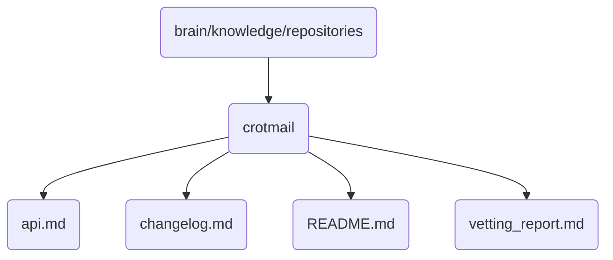

# Crotmail Identity

The crotmail directory contains the core documentation and reports related to OmniClaw's email handling capabilities in version 5.0.

## Topological View

---
*OmniClaw V5.0 | Forged by AI Architect | Evaluated dynamically*
