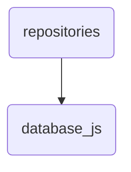

# Database Js Identity

This directory contains JavaScript files related to database operations within OmniClaw, including README and vetting report.

---

## Topological View

---
*OmniClaw V5.0 | Forged by OMA AI Architect | brain.knowledge.repositories.database_js | 2026-04-10*
