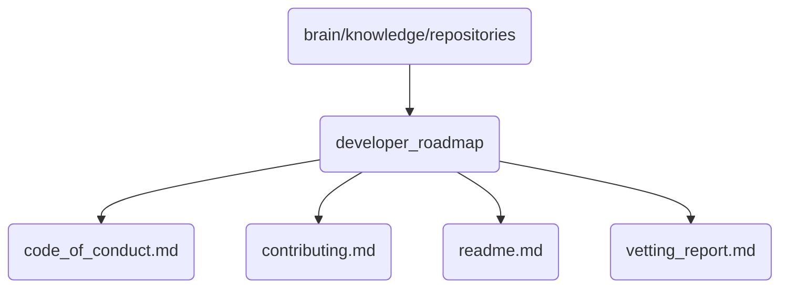

# Developer Roadmap Identity

This directory contains essential documents and guidelines for the development community of OmniClaw v5.0, including code of conduct, contributing instructions, and a vetting report.

## Topological View

---
*OmniClaw V5.0 | Forged by AI Architect | Evaluated dynamically*
