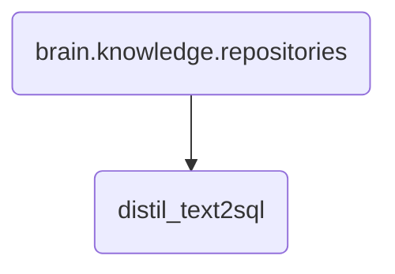

# Distil Text2Sql Identity

The 'distil_text2sql' directory contains the vetting and documentation for the text-to-SQL model within OmniClaw v5.0, ensuring its reliability and accuracy.

---

## Topological View

---
*OmniClaw V5.0 | Forged by OMA AI Architect | brain.knowledge.repositories.distil_text2sql | 2026-04-10*
