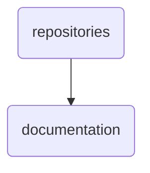

# Documentation Identity

The 'documentation' directory serves as the central repository for all OmniClaw v5.0 documentation, including user guides, changelogs, and contribution guidelines.

---

## Topological View

---
*OmniClaw V5.0 | Forged by OMA AI Architect | brain.knowledge.repositories.documentation | 2026-04-10*
