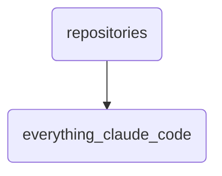

# Everything Claude Code Identity

This directory holds the source code and related documentation for Claude, a key component of OmniClaw. It includes setup instructions, security guidelines, and community contribution policies.

---

## Topological View

---
*OmniClaw V5.0 | Forged by OMA AI Architect | brain.knowledge.repositories.everything_claude_code | 2026-04-10*
