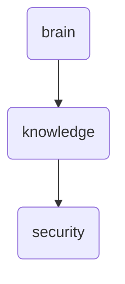

# Security Identity

This directory contains various security-related documents and reports, including penetration test results, code analysis reports, and quarantine guidelines. It serves as a central repository for security assessments within OmniClaw.

---

## Topological View

---
*OmniClaw V5.0 | Forged by OMA AI Architect | brain.knowledge.security | 2026-04-10*
