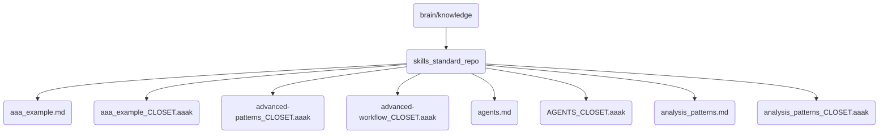

# Skills Standard Repo Identity

This directory contains the standard repository of skills for OmniClaw v5.0, including examples and advanced patterns.

## Topological View

---
*OmniClaw V5.0 | Forged by AI Architect | Evaluated dynamically*
