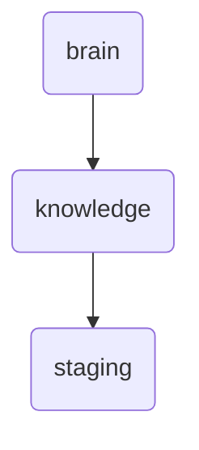

# Staging Identity

The staging directory serves as a temporary storage area for updated or new knowledge items before they are officially integrated into the main brain. It ensures that changes can be tested and validated without affecting the live system.

---

## Topological View

---
*OmniClaw V5.0 | Forged by OMA AI Architect | brain.knowledge.staging | 2026-04-10*
