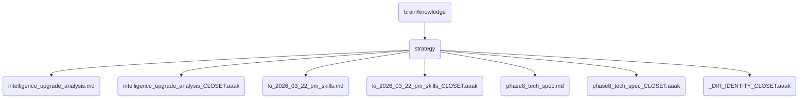

# Strategy Identity

This directory contains strategic documents and analyses related to the intelligence upgrade of OmniClaw v5.0, focusing on key skills and technical specifications.

## Topological View

---
*OmniClaw V5.0 | Forged by AI Architect | Evaluated dynamically*
