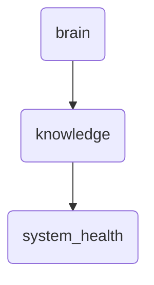

# System Health Identity

This directory contains knowledge base documents and metadata related to the health monitoring of OmniClaw's system components. It ensures that all critical system functions are operating within expected parameters.

---

## Topological View

---
*OmniClaw V5.0 | Forged by OMA AI Architect | brain.knowledge.system_health | 2026-04-10*
