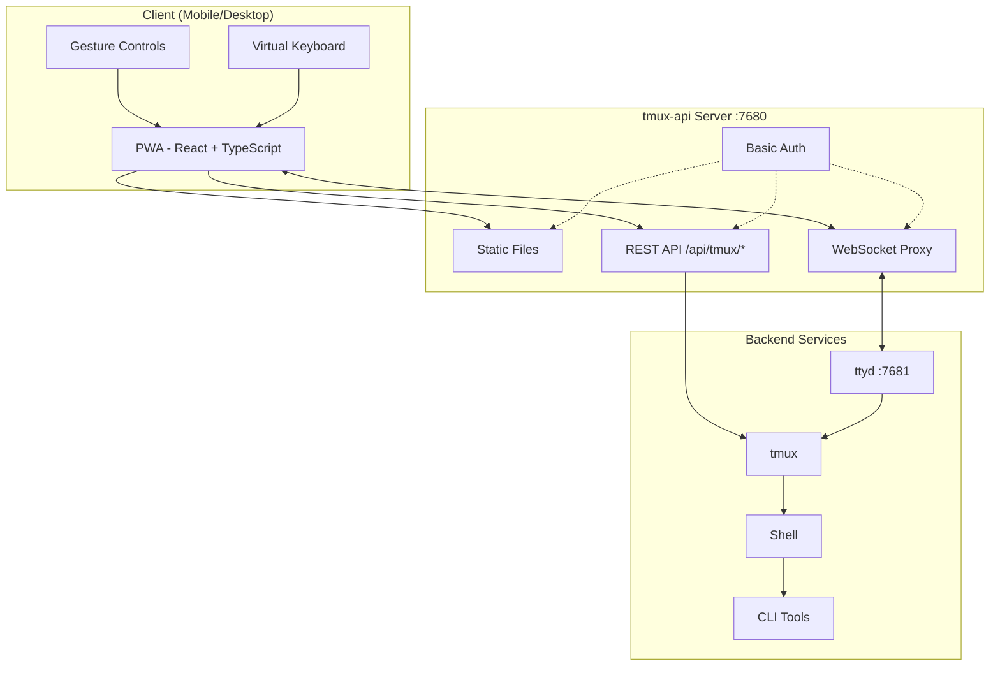
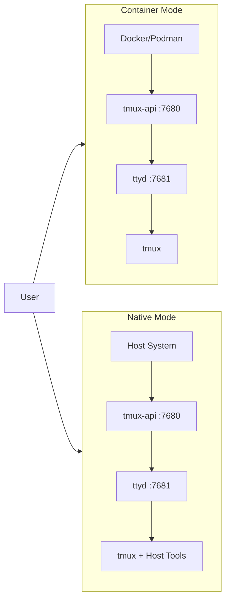
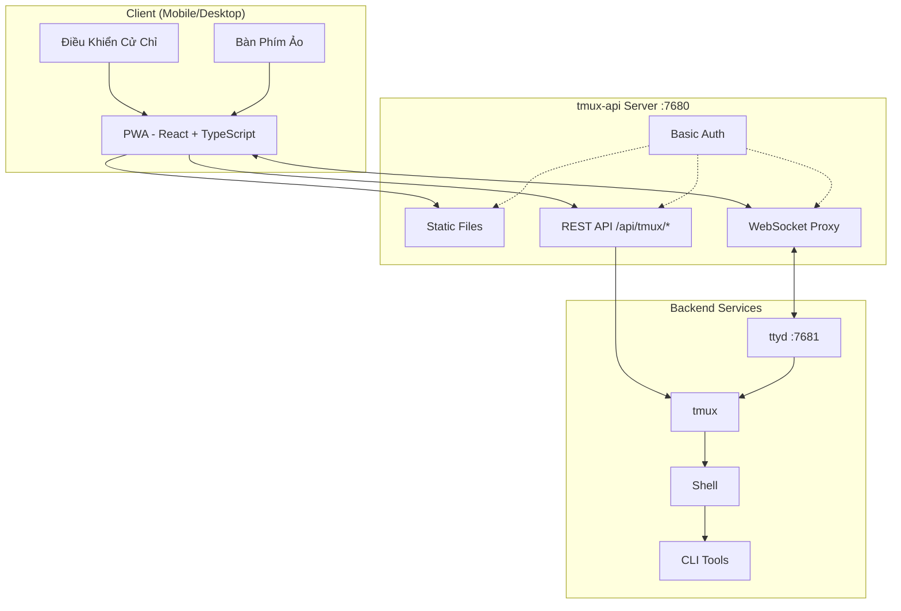
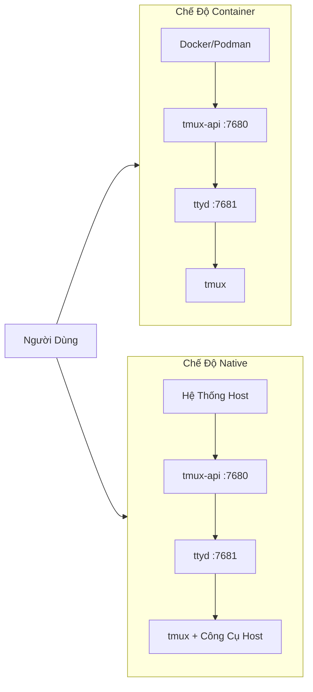

# termote
Raw knowledge dump assimilated by OA.

## SWALLOW ENGINE DISTILLATION

### File: README.md
```md
<p align="center">
  
</p>

<p align="center">
  <a href="https://github.com/lamngockhuong/termote/releases"></a>
  <a href="https://github.com/lamngockhuong/termote/actions/workflows/ci.yml"></a>
  <a href="https://github.com/lamngockhuong/termote/blob/main/LICENSE"></a>
  <a href="https://ghcr.io/lamngockhuong/termote"></a>
  <a href="https://hub.docker.com/r/lamngockhuong/termote"></a>
</p>

<p align="center">
  
  
  
  
</p>

Remote control CLI tools (Claude Code, GitHub Copilot, any terminal) from mobile/desktop via PWA.

> **Termote** = Terminal + Remote
>
> [Tiếng Việt](README.vi.md)

## Features

- **Session switching**: Multiple tmux sessions with create/edit/delete
- **Mobile-friendly**: Virtual keyboard toolbar (Tab/Ctrl/Shift/arrows, expandable)
- **Gesture support**: Swipe for Ctrl+C, Tab, history navigation
- **PWA**: Installable to homescreen, offline-capable
- **Persistent sessions**: tmux keeps sessions alive
- **Collapsible sidebar**: Desktop UI with toggleable session sidebar
- **Fullscreen mode**: Immersive terminal experience
- **Config persistence**: Auto-save installation settings with AES-256 encrypted password

## Screenshots

<p align="center">
  
  &nbsp;&nbsp;
  
</p>

## Architecture



## Quick Start

```bash
./scripts/termote.sh                   # Interactive menu
./scripts/termote.sh install container # Container mode (docker/podman)
./scripts/termote.sh install native    # Native mode (host tools)
make test                              # Run tests
```

> **Tip**: Install [gum](https://github.com/charmbracelet/gum) for enhanced interactive menus (optional, bash fallback available)

## Installation

### One-liner (recommended)

```bash
# Download and prompt before install (defaults to native mode)
curl -fsSL https://raw.githubusercontent.com/lamngockhuong/termote/main/scripts/get.sh | bash

# Auto-install without prompt
curl -fsSL .../get.sh | bash -s -- --yes

# Download only (no install)
curl -fsSL .../get.sh | bash -s -- --download-only

# Auto-update with saved config
curl -fsSL .../get.sh | bash -s -- --update

# Install specific version
curl -fsSL .../get.sh | bash -s -- --version 0.0.4

# With explicit mode and options
curl -fsSL .../get.sh | bash -s -- --yes --container --lan
curl -fsSL .../get.sh | bash -s -- --yes --native --tailscale myhost

# Force new password (ignore saved config)
curl -fsSL .../get.sh | bash -s -- --yes --container --fresh
```

### Docker

```bash
# All-in-one (auto-generates credentials, check logs: docker logs termote)
docker run -d --name termote -p 7680:7680 ghcr.io/lamngockhuong/termote:latest

# With custom credentials
docker run -d --name termote -p 7680:7680 \
  -e TERMOTE_USER=admin -e TERMOTE_PASS=secret \
  ghcr.io/lamngockhuong/termote:latest

# Without auth (local dev only)
docker run -d --name termote -p 7680:7680 \
  -e NO_AUTH=true \
  ghcr.io/lamngockhuong/termote:latest

# With volume for persistence
docker run -d --name termote -p 7680:7680 \
  -v termote-data:/home/termote \
  ghcr.io/lamngockhuong/termote:latest

# Mount custom workspace directory
docker run -d --name termote -p 7680:7680 \
  -v ~/projects:/workspace \
  ghcr.io/lamngockhuong/termote:latest

# With Tailscale HTTPS (requires Tailscale on host)
docker run -d --name termote -p 7680:7680 \
  -e TERMOTE_USER=admin -e TERMOTE_PASS=secret \
  ghcr.io/lamngockhuong/termote:latest
sudo tailscale serve --bg --https=443 http://127.0.0.1:7680
# Access at: https://your-hostname.tailnet-name.ts.net
```

### From Release

```bash
# Download latest release
VERSION=$(curl -s https://api.github.com/repos/lamngockhuong/termote/releases/latest | grep tag_name | cut -d '"' -f4)
wget https://github.com/lamngockhuong/termote/releases/download/${VERSION}/termote-${VERSION}.tar.gz
tar xzf termote-${VERSION}.tar.gz
cd termote-${VERSION#v}

# Install (interactive menu or with mode)
./scripts/termote.sh install
./scripts/termote.sh install container
```

### From Source

```bash
git clone https://github.com/lamngockhuong/termote.git
cd termote
./scripts/termote.sh install container
```

> **Note**: `termote.sh` is the unified CLI supporting `install` (builds from source, uses pre-built artifacts when available), `uninstall`, and `health` commands.

## Deployment Modes



| Mode          | Description    | Use Case                        | Platform     |
| ------------- | -------------- | ------------------------------- | ------------ |
| `--container` | Container mode | Simple deployment, isolated env | macOS, Linux |
| `--native`    | All native     | Host tool access (claude, gh)   | macOS, Linux |

### Options

| Flag                        | Description                                     |
| --------------------------- | ----------------------------------------------- |
| `--lan`                     | Expose to LAN (default: localhost only)         |
| `--tailscale <host[:port]>` | Enable Tailscale HTTPS                          |
| `--no-auth`                 | Disable basic authentication                    |
| `--port <port>`             | Host port (default: 7680)                       |
| `--fresh`                   | Force new password prompt (ignore saved config) |
| `--update`                  | Auto-update with saved config                   |
| `--version <ver>`           | Install specific version (with or without `v`)  |

| Environment Variable | Description                                      |
| -------------------- | ------------------------------------------------ |
| `WORKSPACE`          | Host directory to mount (default: `./workspace`) |
| `TERMOTE_USER`       | Basic auth username (default: auto-generated)    |
| `TERMOTE_PASS`       | Basic auth password (default: auto-generated)    |
| `NO_AUTH`            | Set to `true` to disable authentication          |

### Container Mode (recommended for simplicity)

Scripts auto-detect `podman` or `docker` — both work identically.

```bash
./scripts/termote.sh install container             # localhost with basic auth
./scripts/termote.sh install container --no-auth   # localhost without auth
./scripts/termote.sh install container --lan       # LAN accessible
# Access: http://localhost:7680

# Custom workspace directory (mounted to /workspace in container)
WORKSPACE=~/projects ./scripts/termote.sh install container
WORKSPACE=/path/to/code make install-container
```

> **Security note**: Avoid mounting `$HOME` directly — sensitive directories like `.ssh`, `.gnupg` will be accessible in container. Mount specific project directories instead.

### Native (recommended for host binary access)

Use when you need access to host binaries (claude, git, etc):

```bash
# Linux
sudo apt install ttyd tmux
# Or: sudo snap install ttyd
./scripts/termote.sh install native

# macOS
brew install ttyd tmux go
./scripts/termote.sh install native
# Access: http://localhost:7680
```

### With Tailscale HTTPS (all modes)

Uses `tailscale serve` for automatic HTTPS (no manual cert management):

```bash
# Tailscale only (default port 443)
./scripts/termote.sh install container --tailscale myhost.ts.net

# Custom port
./scripts/termote.sh install native --tailscale myhost.ts.net:8765

# Tailscale + LAN accessible
./scripts/termote.sh install container --tailscale myhost.ts.net --lan

# Access: https://myhost.ts.net (or :8765 for custom port)
```

### Uninstall

```bash
./scripts/termote.sh uninstall container   # Container mode
./scripts/termote.sh uninstall native      # Native mode
./scripts/termote.sh uninstall all         # Everything
```

### Updating

```bash
# Option 1: Auto-update with saved config
curl -fsSL .../get.sh | bash -s -- --update

# Option 2: Re-run one-liner (compares versions, prompts before install)
curl -fsSL .../get.sh | bash

# Option 3: Manual update
./scripts/termote.sh uninstall [container|native]
git pull origin main                    # If installed from source
./scripts/termote.sh install [container|native] [--lan] [--tailscale ...]
```

## Platform Support

| Platform | Container | Native |
| -------- | --------- | ------ |
| Linux    | ✓         | ✓      |
| macOS    | ✓         | ✓      |
| Windows  | ✓ (WSL2)  | -      |

## Mobile Usage

| Action           | Gesture             |
| ---------------- | ------------------- |
| Cancel/interrupt | Swipe left (Ctrl+C) |
| Tab completion   | Swipe right         |
| History up       | Swipe up            |
| History down     | Swipe down          |
| Paste            | Long press          |
| Font size        | Pinch in/out        |

Virtual toolbar provides: Tab, Esc, Ctrl, Shift, Arrow keys, and common key combos. Supports Ctrl+Shift combinations (paste, copy). Toggle between minimal and expanded mode for additional keys (Home, End, Delete, etc.).

## Project Structure

```
termote/
├── Makefile                # Build/test/deploy commands
├── Dockerfile              # Docker mode (tmux-api + ttyd)
├── docker-compose.yml
├── entrypoint.sh           # Docker entrypoint
├── docs/                   # Documentation
│   └── images/screenshots/ # App screenshots
├── pwa/                    # React PWA
│   └── src/
│       ├── components/
│       ├── contexts/
│       ├── hooks/
│       ├── types/
│       └── utils/
├── tmux-api/               # Go server
│   ├── main.go             # Entry point
│   ├── serve.go            # Server (PWA, proxy, auth)
│   └── tmux.go             # tmux API handlers
├── scripts/
│   ├── termote.sh          # Unified CLI (install/uninstall/health)
│   └── get.sh              # Online installer (curl | bash)
├── tests/                  # Test suite
│   ├── test-termote.sh
│   ├── test-get.sh
│   └── test-entrypoints.sh
└── website/                # Astro Starlight docs site
    └── src/content/docs/   # MDX documentation
```

## Development

```bash
make build          # Build PWA and tmux-api
make test           # Run all tests
make health         # Check service health
make clean          # Stop containers

# E2E tests (requires running server)
./scripts/termote.sh install container  # Start server first
cd pwa && pnpm test:e2e       # Run Playwright tests
cd pwa && pnpm test:e2e:ui    # Run with UI debugger
```

**Manual Testing:** See [Self-Test Checklist](docs/self-test-checklist.md)

## Troubleshooting

### Session not persisting

- Check tmux: `tmux ls`
- Verify ttyd uses `-A` flag (attach-or-create)

### WebSocket errors

- Check tmux-api logs: `docker logs termote`
- Verify ttyd is running on port 7681

### Mobile keyboard issues

- Ensure viewport meta tag is present
- Test on real device, not emulator

### Native mode: processes not starting

```bash
ps aux | grep ttyd         # Check if ttyd is running
ps aux | grep tmux-api     # Check if tmux-api is running
lsof -i :7680              # Verify port is in use
```

## Security Notes

- **Default: localhost only** - not exposed to LAN unless `--lan` flag used
- **Basic auth enabled by default** - use `--no-auth` to disable for local dev
- **Built-in brute-force protection** - rate limiting (5 attempts/min per IP)
- Use HTTPS (Tailscale) for production
- Restrict to trusted networks/VPN

## License

MIT

```

### File: website\package.json
```json
{
  "name": "@termote/website",
  "type": "module",
  "version": "0.0.1",
  "scripts": {
    "dev": "astro dev",
    "build": "astro build",
    "preview": "astro preview",
    "astro": "astro"
  },
  "dependencies": {
    "@astrojs/starlight": "0.38.2",
    "astro": "6.0.8",
    "sharp": "0.34.5"
  }
}

```

### File: .release_please_manifest.json
```json
{".":"0.0.7"}

```

### File: CHANGELOG.md
```md
# Changelog

## [0.0.7](https://github.com/lamngockhuong/termote/compare/v0.0.6...v0.0.7) (2026-03-26)


### Features

* **cli:** config persistence, version pinning, and auto-update ([#57](https://github.com/lamngockhuong/termote/issues/57)) ([fdc8896](https://github.com/lamngockhuong/termote/commit/fdc88960fc8bc9c48ac745d2c363bf5324d33171))
* **pwa:** add Clear Cache & Reload button to settings menu ([#67](https://github.com/lamngockhuong/termote/issues/67)) ([d111775](https://github.com/lamngockhuong/termote/commit/d111775b415833f95414d0ca44d9a43e7cf0b16f))


### Bug Fixes

* **cli:** display correct version for RC releases ([#61](https://github.com/lamngockhuong/termote/issues/61)) ([5359710](https://github.com/lamngockhuong/termote/commit/53597103b2654b89ed8934015600d7bf4bedc1fc))
* **cli:** pre-cache sudo credentials for uninterrupted tailscale operations ([#64](https://github.com/lamngockhuong/termote/issues/64)) ([41caa11](https://github.com/lamngockhuong/termote/commit/41caa111500df9794bdcc12476a0673e1f7623d2))
* **cli:** stop all services before binary copy to avoid "Text file busy" ([29fcc62](https://github.com/lamngockhuong/termote/commit/29fcc62ee2e1c9199c3a294f4ef9420b52eeb945))
* **cli:** stop services before binary copy on reinstall ([#60](https://github.com/lamngockhuong/termote/issues/60)) ([29fcc62](https://github.com/lamngockhuong/termote/commit/29fcc62ee2e1c9199c3a294f4ef9420b52eeb945))
* **deps:** update dependency lucide-react to v1.7.0 ([#62](https://github.com/lamngockhuong/termote/issues/62)) ([53fcc34](https://github.com/lamngockhuong/termote/commit/53fcc3497a9fb87cd70fa509e0af5e767a403996))
* **server:** allow missing Sec-Fetch-Dest for mobile browser compatibility ([#65](https://github.com/lamngockhuong/termote/issues/65)) ([1b255c2](https://github.com/lamngockhuong/termote/commit/1b255c2dc20a44c415b7ccd0c03738d9f35b70fe))
* **server:** allow missing Sec-Fetch-Dest header for mobile browser compatibility ([1b255c2](https://github.com/lamngockhuong/termote/commit/1b255c2dc20a44c415b7ccd0c03738d9f35b70fe))
* **server:** bypass auth for PWA manifest/sw.js to fix Chrome LAN 401 error ([#69](https://github.com/lamngockhuong/termote/issues/69)) ([5cd0bed](https://github.com/lamngockhuong/termote/commit/5cd0beda19513a662f5a6581e3ff7035ddd5168d))

## [0.0.6](https://github.com/lamngockhuong/termote/compare/v0.0.5...v0.0.6) (2026-03-25)


### Features

* **pwa:** collapsible sidebar and fullscreen toggle ([#56](https://github.com/lamngockhuong/termote/issues/56)) ([3115d03](https://github.com/lamngockhuong/termote/commit/3115d035c5cbd36dc1138f2eb9bb984bb7a88e9a))


### Bug Fixes

* **deps:** update dependency lucide-react to v1.6.0 ([#50](https://github.com/lamngockhuong/termote/issues/50)) ([46241b8](https://github.com/lamngockhuong/termote/commit/46241b8d23e449374a00e63ae52584726d84e9cc))
* **pwa:** add vite-env.d.ts to fix TypeScript type check ([#55](https://github.com/lamngockhuong/termote/issues/55)) ([810608d](https://github.com/lamngockhuong/termote/commit/810608dab1c870442167dd3ed3792ceef21c90fb))
* **security:** enforce auth on /terminal/ endpoint ([#49](https://github.com/lamngockhuong/termote/issues/49)) ([42b9731](https://github.com/lamngockhuong/termote/commit/42b9731ac5dff2da298be78633e7edd6d8f18f6f))
* **security:** server hardening and security audit ([#52](https://github.com/lamngockhuong/termote/issues/52)) ([1b54be5](https://github.com/lamngockhuong/termote/commit/1b54be583a141516e621ef730e731e56c1ca7493))

## [0.0.5](https://github.com/lamngockhuong/termote/compare/v0.0.4...v0.0.5) (2026-03-24)


### Features

* **keyboard:** add Shift modifier and expand/collapse mode ([#40](https://github.com/lamngockhuong/termote/issues/40)) ([4cbdf85](https://github.com/lamngockhuong/termote/commit/4cbdf85e087f087e3a25afcdb551c547721d60c0))


### Bug Fixes

* **deps:** update dependency lucide-react to v1 ([#46](https://github.com/lamngockhuong/termote/issues/46)) ([6637010](https://github.com/lamngockhuong/termote/commit/66370102232db274ac0ceb0fd977fdc7cc977013))
* **deps:** update dependency lucide-react to v1.0.1 ([#47](https://github.com/lamngockhuong/termote/issues/47)) ([7a4598a](https://github.com/lamngockhuong/termote/commit/7a4598a3942964721a45c499f6abd099ea4d5fd0))
* **gestures:** enable swipe scroll in IME input mode ([#42](https://github.com/lamngockhuong/termote/issues/42)) ([8064077](https://github.com/lamngockhuong/termote/commit/80640777fd33fbce1a66dd7af66ae0db6b11090f))

## [0.0.4](https://github.com/lamngockhuong/termote/compare/v0.0.3...v0.0.4) (2026-03-22)


### Bug Fixes

* **installer:** read from /dev/tty for piped script input ([#37](https://github.com/lamngockhuong/termote/issues/37)) ([bcc927a](https://github.com/lamngockhuong/termote/commit/bcc927a97a1424f66571e8935de96d9989aa8cc9))

## [0.0.3](https://github.com/lamngockhuong/termote/compare/v0.0.2...v0.0.3) (2026-03-22)


### Features

* add logging support for native services ([#34](https://github.com/lamngockhuong/termote/issues/34)) ([3d2a662](https://github.com/lamngockhuong/termote/commit/3d2a6627a9af1dd5d45b930b69e9e859ab1b9119))
* **installer:** add version check and update prompts ([#35](https://github.com/lamngockhuong/termote/issues/35)) ([eb97b5a](https://github.com/lamngockhuong/termote/commit/eb97b5a778c94e92529f22c0866d54b121315340))


### Bug Fixes

* format code blocks in native installation docs ([3f32ce2](https://github.com/lamngockhuong/termote/commit/3f32ce21557a71b295a9c3afc78f324465949805))

## [0.0.2](https://github.com/lamngockhuong/termote/compare/v0.0.1...v0.0.2) (2026-03-22)


### Bug Fixes

* add Darwin binaries for native mode on macOS ([#28](https://github.com/lamngockhuong/termote/issues/28)) ([b411a37](https://github.com/lamngockhuong/termote/commit/b411a37724f941444d050ba97ba02f77eb1c9df3))
* improve security and enable auto version bumping ([#25](https://github.com/lamngockhuong/termote/issues/25)) ([854c205](https://github.com/lamngockhuong/termote/commit/854c2058be573f39625631b4c8b63c1ba9385981))
* improve security and health check output ([#23](https://github.com/lamngockhuong/termote/issues/23)) ([5e8e21d](https://github.com/lamngockhuong/termote/commit/5e8e21d39b751034de26dc560729758b5835f7a1))
* resolve empty LAN IP on macOS ([#29](https://github.com/lamngockhuong/termote/issues/29)) ([d084391](https://github.com/lamngockhuong/termote/commit/d0843914cd23949f1011b4ff6c4a141f365cac5f))
* resolve empty LAN IP on macOS in container mode ([d084391](https://github.com/lamngockhuong/termote/commit/d0843914cd23949f1011b4ff6c4a141f365cac5f))
* resolve macOS shell compatibility and terminal artifacts ([#27](https://github.com/lamngockhuong/termote/issues/27)) ([ecc4062](https://github.com/lamngockhuong/termote/commit/ecc4062bf377e01998da76e07b3ba464582875e8))

## 0.0.1 (2026-03-22)


### Features

* Termote - Terminal + Remote PWA ([f373d9d](https://github.com/lamngockhuong/termote/commit/f373d9d024e51f4d473c6d103b4d388e38996a41))

```

### File: CLAUDE.md
```md
# CLAUDE.md

Instructions for Claude Code when working with this repository.

## Project Overview

**Termote** = Terminal + Remote

A PWA for remotely controlling CLI tools (Claude Code, GitHub Copilot, any terminal) from mobile/desktop.

## Tech Stack

| Layer           | Technology                                 |
| --------------- | ------------------------------------------ |
| Frontend        | React 19 + TypeScript + Vite + TailwindCSS |
| PWA             | vite-plugin-pwa + Workbox                  |
| Terminal        | ttyd (WebSocket terminal)                  |
| Server          | Go (tmux-api serve mode)                   |
| Sessions        | tmux (persistent sessions)                 |
| Package Manager | pnpm                                       |

## Project Structure

```
termote/
├── Dockerfile              # Docker mode (tmux-api + ttyd)
├── docker-compose.yml
├── pwa/                    # React PWA frontend
│   ├── src/
│   │   ├── components/     # React components
│   │   ├── hooks/          # Custom React hooks
│   │   ├── types/          # TypeScript types
│   │   └── utils/          # Utility functions
│   ├── package.json
│   └── vite.config.ts
├── tmux-api/               # Go server (PWA + proxy + API)
│   ├── main.go             # Entry point
│   ├── serve.go            # Server (static files, proxy, auth)
│   └── tmux.go             # tmux API handlers
├── scripts/                # Shell scripts
│   ├── termote.sh          # Unified CLI (install/uninstall/health)
│   └── get.sh              # Online installer (curl-able)
├── tests/                  # Test suite
│   ├── test-termote.sh     # CLI tests
│   ├── test-get.sh         # Online installer tests
│   └── test-entrypoints.sh # Docker entrypoint tests
├── website/                # Documentation site (Astro Starlight)
│   └── src/content/docs/   # MDX docs (EN + VI)
└── Makefile                # Build/test/deploy commands
```

## Deployment Modes

| Mode          | Description               | Use Case                        | Platform     |
| ------------- | ------------------------- | ------------------------------- | ------------ |
| `--container` | Container mode            | Simple deployment, isolated env | macOS, Linux |
| `--native`    | All native (no container) | Host tool access (Claude Code)  | macOS, Linux |

```bash
./scripts/termote.sh                                   # Interactive menu
./scripts/termote.sh install container                 # Container mode (saves config)
./scripts/termote.sh install container --lan           # LAN accessible
./scripts/termote.sh install native                    # Native mode (host tools)
./scripts/termote.sh install container --no-auth       # Without auth
./scripts/termote.sh install container --tailscale host  # Tailscale HTTPS
./scripts/termote.sh install container --fresh         # Force new password (ignore saved)
curl -fsSL https://... | bash -s -- --update           # Auto-update with saved config
```

## Development Commands

```bash
# Using Makefile (recommended)
make build          # Build PWA + tmux-api
make test           # Run all tests
make deploy-container  # Deploy container (docker/podman)
make health         # Check services

# Manual commands
cd pwa && pnpm install && pnpm dev     # Dev server
cd pwa && pnpm tsc --noEmit            # Type check
cd tmux-api && go build -o tmux-api .  # Build server
```

### Cross-Compilation (macOS for Linux Container)

When building Docker images on macOS, tmux-api is cross-compiled to Linux:

```bash
# Automatic (termote.sh handles this)
cd tmux-api && GOOS=linux GOARCH=amd64 go build -ldflags="-s -w" -o tmux-api .

# For ARM64 (Apple Silicon):
cd tmux-api && GOOS=linux GOARCH=arm64 go build -ldflags="-s -w" -o tmux-api .
```

## Architecture

Both modes use tmux-api as the unified server (PWA + WebSocket proxy + API + auth):

```
┌─────────────────────────────────────────────────────────┐
│ Container mode (all-in-one container)                   │
│   tmux-api:7680 (PWA + proxy + API + auth)              │
│   ├→ static PWA files                                   │
│   ├→ WebSocket proxy to ttyd:7681                       │
│   └→ tmux API endpoints (/api/tmux/*)                   │
│   ttyd:7681 → tmux                                      │
│   Container Runtime: auto-detect podman or docker       │
└─────────────────────────────────────────────────────────┘

┌─────────────────────────────────────────────────────────┐
│ Native mode (macOS & Linux)                             │
│   tmux-api:7680 (PWA + proxy + API + auth)              │
│   ├→ static PWA files                                   │
│   ├→ WebSocket proxy to ttyd:7681                       │
│   └→ tmux API endpoints                                 │
│   ttyd:7681 → tmux                                      │
│   No container required                                 │
└─────────────────────────────────────────────────────────┘
```

## Code Conventions

- **File naming**: kebab-case for all files (e.g., `keyboard-toolbar.tsx`)
- **Components**: Function components with TypeScript
- **Hooks**: Prefix with `use-` (e.g., `use-session.ts`)
- **State**: React hooks (useState, useCallback, useMemo)
- **Styling**: TailwindCSS utility classes

### Shell Scripts (Cross-Platform)

- Use `grep -oE` (extended regex) instead of `grep -oP` (Perl regex, Linux-only)
- Use `ipconfig getifaddr en0` fallback for `hostname -I` on macOS
- Use `$(uname)` to detect Darwin (macOS) vs Linux
- Use `$(uname -m)` for architecture detection (x86_64, aarch64)

## Key Files

| File                                      | Purpose                                   |
| ----------------------------------------- | ----------------------------------------- |
| `pwa/src/App.tsx`                         | Main app with gestures, toolbar, sessions |
| `pwa/src/components/keyboard-toolbar.tsx` | Virtual keyboard for mobile               |
| `pwa/src/hooks/use-gestures.ts`           | Hammer.js gesture handling                |
| `tmux-api/main.go`                        | Entry point                               |
| `tmux-api/serve.go`                       | Server (PWA, WebSocket proxy, auth)       |
| `tmux-api/tmux.go`                        | tmux API handlers                         |
| `Dockerfile`                              | Docker mode container                     |
| `entrypoint.sh`                           | Container entrypoint                      |

## Container Runtime Support

Scripts auto-detect container runtime in this priority:

1. **podman** (preferred, lighter-weight)
2. **docker** (fallback)

Both Docker Desktop and Podman work on all platforms (macOS, Linux).

## Security Notes

- Basic auth enabled by default (use `--no-auth` to disable for local dev)
- Basic auth over HTTPS required for production
- **ttyd binds to localhost only** - external access via tmux-api proxy (handles auth)
- **`/terminal/` endpoint**: 3-layer protection — basic auth + Sec-Fetch-Dest check (blocks direct navigation) + single-use token (30s TTL, consumed on iframe load)
- tmux-api binds to localhost by default, use `--lan` to expose to network
- Same-origin iframe setup via tmux-api proxy
- PostMessage uses explicit origin (not wildcard)
- Exclude sensitive dirs (.ssh, .gnupg) from volume mounts
- Serve mode uses constant-time comparison for password verification
- **Brute-force protection**: built-in rate limiter (5 failed attempts/min per IP → 429)
- **Server hardening**: ReadHeaderTimeout (Slowloris protection), request body size limits (8KB on send-keys)
- **Error sanitization**: internal errors logged server-side only, generic messages returned to clients
- **Config persistence**: saved password encrypted with AES-256-CBC + PBKDF2 (machine-derived key), config file chmod 600, password hidden on subsequent runs

## Testing

```bash
make test             # Run all tests
make test-cli         # Test termote.sh CLI
make test-get         # Test online installer
make test-entrypoints # Test Docker entrypoints

# Manual checks
cd pwa && pnpm tsc --noEmit          # Type check
curl http://localhost:7680/api/tmux/health  # Test API

# E2E tests (requires running server)
./scripts/termote.sh install container  # Start server first
cd pwa && pnpm test:e2e              # Run Playwright tests
cd pwa && pnpm test:e2e:ui           # Run with UI debugger
```

```

### File: CONTRIBUTING.md
```md
# Contributing to Termote

## Getting Started

```bash
git clone https://github.com/lamngockhuong/termote.git
cd termote
make build
make deploy-container
```

## Development Setup

### Prerequisites

- Node.js 18+
- pnpm
- Go 1.21+
- Docker (optional)

### PWA Development

```bash
cd pwa
pnpm install
pnpm dev          # Dev server at http://localhost:5173
pnpm tsc --noEmit # Type check
pnpm lint         # Biome
```

### tmux-api Development

```bash
cd tmux-api
go build -o tmux-api .
./tmux-api        # Runs on :7682
```

## Code Standards

- **File naming**: kebab-case (`keyboard-toolbar.tsx`)
- **Hooks**: Prefix with `use-` (`use-gestures.ts`)
- **Components**: Functional components with TypeScript
- **Styling**: TailwindCSS utilities

See [docs/code-standards.md](docs/code-standards.md) for details.

## Formatting

```bash
make fmt         # Format markdown/mdx files
make fmt-check   # Check formatting (CI)
```

**MDX Caveat:** When editing MDX files with Astro components (`<Steps>`, `<Tabs>`), ensure closing tags are NOT indented:

```mdx
<Steps>
1. Step one
2. Step two

</Steps>   <!-- Correct: at line start -->
```

Indented closing tags break the build.

## Testing

```bash
make test              # All tests
make test-deploy       # Deploy script tests
make test-uninstall    # Uninstall script tests

# E2E (requires running server)
cd pwa && pnpm test:e2e
```

## Commit Messages

Use [Conventional Commits](https://www.conventionalcommits.org/):

```
feat: add new gesture support
fix: resolve WebSocket reconnection issue
docs: update deployment guide
refactor: simplify session management
test: add e2e tests for sidebar
chore: update dependencies
```

## Pull Request Process

1. Fork and create feature branch from `main`
2. Make changes with tests
3. Run `make test` and `pnpm tsc --noEmit`
4. Submit PR with clear description

### PR Checklist

- [ ] Code follows project conventions
- [ ] Tests pass locally
- [ ] TypeScript compiles without errors
- [ ] Commit messages follow conventional format
- [ ] Documentation updated if needed

## Project Structure

```
termote/
├── pwa/           # React PWA frontend
├── tmux-api/      # Go server (PWA + proxy + API + auth)
├── scripts/       # Shell scripts
├── tests/         # Test suite
└── docs/          # Documentation
```

## Reporting Issues

- Use GitHub Issues
- Include: OS, browser, deployment mode
- Provide steps to reproduce
- Attach logs if applicable

## License

By contributing, you agree that your contributions will be licensed under MIT.

```

### File: dprint.json
```json
{
  "$schema": "https://dprint.dev/schemas/v0.json",
  "lineWidth": 120,
  "indentWidth": 2,
  "useTabs": false,
  "markdown": {
    "lineWidth": 120,
    "textWrap": "maintain",
    "associations": ["**/*.mdx"]
  },
  "includes": [
    "**/*.md",
    "**/*.mdx"
  ],
  "excludes": [
    "**/node_modules",
    "**/dist",
    "**/.git",
    "**/CHANGELOG.md"
  ],
  "plugins": [
    "https://plugins.dprint.dev/markdown-0.17.8.wasm"
  ]
}

```

### File: entrypoint.sh
```sh
#!/bin/bash
# All-in-one entrypoint: tmux-api (serve mode) + ttyd

# Add current user/group to passwd/group if not exists
if ! getent group $(id -g) >/dev/null 2>&1; then
    echo "termote:x:$(id -g):" >> /etc/group 2>/dev/null || true
fi
if ! getent passwd $(id -u) >/dev/null 2>&1; then
    echo "termote:x:$(id -u):$(id -g)::/home/termote:/bin/bash" >> /etc/passwd 2>/dev/null || true
fi
# Lock down passwd/group after entrypoint writes
chmod 644 /etc/passwd /etc/group 2>/dev/null || true

# Create home directory structure
mkdir -p /home/termote/.local/share/nano 2>/dev/null || true
export HOME=/home/termote

# Show auth status
if [[ "$NO_AUTH" != "true" ]]; then
    if [[ -z "$TERMOTE_PASS" ]]; then
        # Auto-generate password if not provided
        export TERMOTE_PASS=$(openssl rand -base64 16 | tr -dc 'a-zA-Z0-9' | head -c 12)
        echo ""
        echo "============================================"
        echo "  TERMOTE CREDENTIALS (auto-generated)"
        echo "  Username: admin"
        echo "  Password: $TERMOTE_PASS"
        echo "============================================"
        echo ""
    else
        echo ""
        echo "============================================"
        echo "  TERMOTE CREDENTIALS (user-provided)"
        echo "  Username: admin"
        echo "  Password: ********"
        echo "============================================"
        echo ""
    fi
fi

# Set environment for tmux-api serve mode
export TERMOTE_PORT="${TERMOTE_PORT:-7680}"
export TERMOTE_BIND="${TERMOTE_BIND:-0.0.0.0}"
export TERMOTE_PWA_DIR="/var/www/termote"
export TERMOTE_TTYD_URL="http://127.0.0.1:7681"
export TERMOTE_USER="${TERMOTE_USER:-admin}"
[[ "$NO_AUTH" == "true" ]] && export TERMOTE_NO_AUTH="true"

# Start tmux-api in background
/usr/local/bin/tmux-api &
TMUX_API_PID=$!

# Trap to cleanup on exit
cleanup() {
    kill $TMUX_API_PID 2>/dev/null
    exit 0
}
trap cleanup SIGTERM SIGINT

# Start ttyd with tmux (foreground)
exec ttyd -W -p 7681 -t fontSize=14 \
    tmux new-session -A -s main

```

### File: README.vi.md
```md
<p align="center">
  
</p>

<p align="center">
  <a href="https://github.com/lamngockhuong/termote/releases"></a>
  <a href="https://github.com/lamngockhuong/termote/actions/workflows/ci.yml"></a>
  <a href="https://github.com/lamngockhuong/termote/blob/main/LICENSE"></a>
  <a href="https://ghcr.io/lamngockhuong/termote"></a>
  <a href="https://hub.docker.com/r/lamngockhuong/termote"></a>
</p>

<p align="center">
  
  
  
  
</p>

Điều khiển từ xa các công cụ CLI (Claude Code, GitHub Copilot, terminal bất kỳ) từ mobile/desktop qua PWA.

> **Termote** = Terminal + Remote
>
> [English](README.md)

## Tính Năng

- **Chuyển đổi session**: Nhiều tmux sessions với tạo/sửa/xóa
- **Thân thiện mobile**: Bàn phím ảo (Tab/Ctrl/Shift/mũi tên, mở rộng được)
- **Hỗ trợ cử chỉ**: Vuốt cho Ctrl+C, Tab, điều hướng lịch sử
- **PWA**: Cài được vào homescreen, hoạt động offline
- **Sessions bền vững**: tmux giữ sessions sống
- **Sidebar thu gọn**: Giao diện desktop với thanh sidebar bật/tắt
- **Chế độ toàn màn hình**: Trải nghiệm terminal toàn màn hình
- **Lưu cấu hình**: Tự động lưu cài đặt với mật khẩu mã hóa AES-256

## Ảnh Chụp Màn Hình

<p align="center">
  
  &nbsp;&nbsp;
  
</p>

## Kiến Trúc



## Bắt Đầu Nhanh

```bash
./scripts/termote.sh                   # Menu tương tác
./scripts/termote.sh install container # Chế độ container (docker/podman)
./scripts/termote.sh install native    # Chế độ native (công cụ host)
make test                              # Chạy tests
```

> **Mẹo**: Cài [gum](https://github.com/charmbracelet/gum) để có menu tương tác đẹp hơn (tùy chọn, có fallback bash)

## Cài Đặt

### Một dòng lệnh (khuyến nghị)

```bash
# Tải về và hỏi trước khi cài (mặc định native mode)
curl -fsSL https://raw.githubusercontent.com/lamngockhuong/termote/main/scripts/get.sh | bash

# Tự động cài không hỏi
curl -fsSL .../get.sh | bash -s -- --yes

# Chỉ tải về (không cài)
curl -fsSL .../get.sh | bash -s -- --download-only

# Cập nhật tự động với config đã lưu
curl -fsSL .../get.sh | bash -s -- --update

# Cài đặt phiên bản cụ thể
curl -fsSL .../get.sh | bash -s -- --version 0.0.4

# Với mode và tùy chọn cụ thể
curl -fsSL .../get.sh | bash -s -- --yes --container --lan
curl -fsSL .../get.sh | bash -s -- --yes --native --tailscale myhost

# Buộc nhập mật khẩu mới (bỏ qua config đã lưu)
curl -fsSL .../get.sh | bash -s -- --yes --container --fresh
```

### Docker

```bash
# Tất cả trong một (tự sinh credentials, xem logs: docker logs termote)
docker run -d --name termote -p 7680:7680 ghcr.io/lamngockhuong/termote:latest

# Với credentials tùy chỉnh
docker run -d --name termote -p 7680:7680 \
  -e TERMOTE_USER=admin -e TERMOTE_PASS=secret \
  ghcr.io/lamngockhuong/termote:latest

# Không xác thực (chỉ dev local)
docker run -d --name termote -p 7680:7680 \
  -e NO_AUTH=true \
  ghcr.io/lamngockhuong/termote:latest

# Với volume để lưu trữ
docker run -d --name termote -p 7680:7680 \
  -v termote-data:/home/termote \
  ghcr.io/lamngockhuong/termote:latest

# Mount thư mục workspace tùy chỉnh
docker run -d --name termote -p 7680:7680 \
  -v ~/projects:/workspace \
  ghcr.io/lamngockhuong/termote:latest

# Với Tailscale HTTPS (yêu cầu Tailscale trên host)
docker run -d --name termote -p 7680:7680 \
  -e TERMOTE_USER=admin -e TERMOTE_PASS=secret \
  ghcr.io/lamngockhuong/termote:latest
sudo tailscale serve --bg --https=443 http://127.0.0.1:7680
# Truy cập tại: https://your-hostname.tailnet-name.ts.net
```

### Từ Release

```bash
# Tải release mới nhất
VERSION=$(curl -s https://api.github.com/repos/lamngockhuong/termote/releases/latest | grep tag_name | cut -d '"' -f4)
wget https://github.com/lamngockhuong/termote/releases/download/${VERSION}/termote-${VERSION}.tar.gz
tar xzf termote-${VERSION}.tar.gz
cd termote-${VERSION#v}

# Cài đặt (menu tương tác hoặc với mode)
./scripts/termote.sh install
./scripts/termote.sh install container
```

### Từ Source

```bash
git clone https://github.com/lamngockhuong/termote.git
cd termote
./scripts/termote.sh install container
```

> **Ghi chú**: `termote.sh` là CLI hợp nhất hỗ trợ `install` (build từ source, dùng artifacts có sẵn khi có), `uninstall`, và `health`.

## Chế Độ Triển Khai



| Chế Độ        | Mô Tả            | Trường Hợp Sử Dụng                      | Nền Tảng     |
| ------------- | ---------------- | --------------------------------------- | ------------ |
| `--container` | Chế độ container | Triển khai đơn giản, môi trường cách ly | macOS, Linux |
| `--native`    | Tất cả native    | Truy cập công cụ host (claude, gh)      | macOS, Linux |

### Tùy Chọn

| Flag                        | Mô Tả                                           |
| --------------------------- | ----------------------------------------------- |
| `--lan`                     | Mở truy cập LAN (mặc định: chỉ localhost)       |
| `--tailscale <host[:port]>` | Bật Tailscale HTTPS                             |
| `--no-auth`                 | Tắt xác thực cơ bản                             |
| `--port <port>`             | Port host (mặc định: 7680)                      |
| `--fresh`                   | Buộc nhập mật khẩu mới (bỏ qua config đã lưu)   |
| `--update`                  | Cập nhật tự động với config đã lưu              |
| `--version <ver>`           | Cài đặt phiên bản cụ thể (có hoặc không có `v`) |

| Biến Môi Trường | Mô Tả                                           |
| --------------- | ----------------------------------------------- |
| `WORKSPACE`     | Thư mục host để mount (mặc định: `./workspace`) |
| `TERMOTE_USER`  | Username xác thực (mặc định: tự sinh)           |
| `TERMOTE_PASS`  | Password xác thực (mặc định: tự sinh)           |
| `NO_AUTH`       | Đặt `true` để tắt xác thực                      |

### Chế Độ Container (khuyến nghị cho đơn giản)

Scripts tự động phát hiện `podman` hoặc `docker` — cả hai hoạt động giống nhau.

```bash
./scripts/termote.sh install container             # localhost với basic auth
./scripts/termote.sh install container --no-auth   # localhost không auth
./scripts/termote.sh install container --lan       # Truy cập LAN
# Truy cập: http://localhost:7680

# Thư mục workspace tùy chỉnh (mount vào /workspace trong container)
WORKSPACE=~/projects ./scripts/termote.sh install container
WORKSPACE=/path/to/code make install-container
```

> **Lưu ý bảo mật**: Tránh mount trực tiếp `$HOME` — các thư mục nhạy cảm như `.ssh`, `.gnupg` sẽ truy cập được trong container. Mount các thư mục project cụ thể thay thế.

### Native (khuyến nghị để truy cập binary host)

Dùng khi cần truy cập binary host (claude, git, v.v.):

```bash
# Linux
sudo apt install ttyd tmux
# Hoặc: sudo snap install ttyd
./scripts/termote.sh install native

# macOS
brew install ttyd tmux go
./scripts/termote.sh install native
# Truy cập: http://localhost:7680
```

### Với Tailscale HTTPS (tất cả chế độ)

Dùng `tailscale serve` cho HTTPS tự động (không cần quản lý cert thủ công):

```bash
# Chỉ Tailscale (port mặc định 443)
./scripts/termote.sh install container --tailscale myhost.ts.net

# Port tùy chỉnh
./scripts/termote.sh install native --tailscale myhost.ts.net:8765

# Tailscale + truy cập LAN
./scripts/termote.sh install container --tailscale myhost.ts.net --lan

# Truy cập: https://myhost.ts.net (hoặc :8765 cho port tùy chỉnh)
```

### Gỡ Cài Đặt

```bash
./scripts/termote.sh uninstall container   # Chế độ container
./scripts/termote.sh uninstall native      # Chế độ native
./scripts/termote.sh uninstall all         # Tất cả
```

### Cập Nhật

```bash
# Cách 1: Cập nhật tự động với config đã lưu
curl -fsSL .../get.sh | bash -s -- --update

# Cách 2: Chạy lại one-liner (so sánh version, hỏi trước khi cài)
curl -fsSL .../get.sh | bash

# Cách 3: Cập nhật thủ công
./scripts/termote.sh uninstall [container|native]
git pull origin main                    # Nếu cài từ source
./scripts/termote.sh install [container|native] [--lan] [--tailscale ...]
```

## Hỗ Trợ Nền Tảng

| Nền Tảng | Container | Native |
| -------- | --------- | ------ |
| Linux    | ✓         | ✓      |
| macOS    | ✓         | ✓      |
| Windows  | ✓ (WSL2)  | -      |

## Sử Dụng Mobile

| Hành Động      | Cử Chỉ             |
| -------------- | ------------------ |
| Hủy/ngắt       | Vuốt trái (Ctrl+C) |
| Tab completion | Vuốt phải          |
| Lịch sử lên    | Vuốt lên           |
| Lịch sử xuống  | Vuốt xuống         |
| Dán            | Nhấn giữ           |
| Cỡ chữ         | Chụm vào/ra        |

Thanh công cụ ảo cung cấp: Tab, Esc, Ctrl, Shift, phím mũi tên, và các tổ hợp phím thường dùng. Hỗ trợ tổ hợp Ctrl+Shift (dán, sao chép). Chuyển đổi giữa chế độ minimal và expanded để có thêm phím (Home, End, Delete, v.v.).

## Cấu Trúc Dự Án

```
termote/
├── Makefile                # Lệnh build/test/deploy
├── Dockerfile              # Docker mode (tmux-api + ttyd)
├── docker-compose.yml
├── entrypoint.sh           # Docker entrypoint
├── docs/                   # Tài liệu
│   └── images/screenshots/ # Ảnh chụp app
├── pwa/                    # React PWA
│   └── src/
│       ├── components/
│       ├── contexts/
│       ├── hooks/
│       ├── types/
│       └── utils/
├── tmux-api/               # Go server
│   ├── main.go             # Entry point
│   ├── serve.go            # Server (PWA, proxy, auth)
│   └── tmux.go             # tmux API handlers
├── scripts/
│   ├── termote.sh          # CLI hợp nhất (install/uninstall/health)
│   └── get.sh              # Online installer (curl | bash)
├── tests/                  # Bộ test
│   ├── test-termote.sh
│   ├── test-get.sh
│   └── test-entrypoints.sh
└── website/                # Trang docs Astro Starlight
    └── src/content/docs/   # Tài liệu MDX
```

## Phát Triển

```bash
make build          # Build PWA và tmux-api
make test           # Chạy tất cả tests
make health         # Kiểm tra health service
make clean          # Dừng containers

# E2E tests (yêu cầu server đang chạy)
./scripts/termote.sh install container  # Khởi động server trước
cd pwa && pnpm test:e2e       # Chạy Playwright tests
cd pwa && pnpm test:e2e:ui    # Chạy với UI debugger
```

**Kiểm Tra Thủ Công:** Xem [Danh Sách Kiểm Tra](docs/self-test-checklist.vi.md)

## Xử Lý Sự Cố

### Session không lưu được

- Kiểm tra tmux: `tmux ls`
- Xác minh ttyd dùng flag `-A` (attach-or-create)

### Lỗi WebSocket

- Kiểm tra logs tmux-api: `docker logs termote`
- Xác minh ttyd đang chạy trên port 7681

### Vấn đề bàn phím mobile

- Đảm bảo có viewport meta tag
- Test trên thiết bị thật, không dùng emulator

### Chế độ native: processes không khởi động

```bash
ps aux | grep ttyd         # Kiểm tra ttyd đang chạy
ps aux | grep tmux-api     # Kiểm tra tmux-api đang chạy
lsof -i :7680              # Xác minh port đang dùng
```

## Ghi Chú Bảo Mật

- **Mặc định: chỉ localhost** - không mở LAN trừ khi dùng flag `--lan`
- **Basic auth bật mặc định** - dùng `--no-auth` để tắt cho dev local
- **Chống brute-force tích hợp** - rate limiting (5 lần thử/phút mỗi IP)
- Dùng HTTPS (Tailscale) cho production
- Giới hạn trong mạng tin cậy/VPN

## Giấy Phép

MIT

```

### File: release_please_config.json
```json
{
  "$schema": "https://raw.githubusercontent.com/googleapis/release-please/main/schemas/config.json",
  "release-type": "simple",
  "packages": {
    ".": {
      "package-name": "termote",
      "include-component-in-tag": false,
      "changelog-path": "CHANGELOG.md",
      "bump-minor-pre-major": true,
      "bump-patch-for-minor-pre-major": true,
      "extra-files": [
        {
          "type": "json",
          "path": "pwa/package.json",
          "jsonpath": "$.version"
        },
        {
          "type": "generic",
          "path": "scripts/termote.sh"
        }
      ]
    }
  }
}

```

### File: renovate.json
```json
{
  "$schema": "https://docs.renovatebot.com/renovate-schema.json",
  "extends": [
    "config:recommended"
  ]
}

```

### File: .github\PULL_REQUEST_TEMPLATE.md
```md
## Summary

<!-- Brief description of what this PR does -->

## Type of Change

- [ ] Bug fix (non-breaking change which fixes an issue)
- [ ] New feature (non-breaking change which adds functionality)
- [ ] Breaking change (fix or feature that would cause existing functionality to not work as expected)
- [ ] Documentation update
- [ ] Refactoring (no functional changes)
- [ ] CI/CD or build configuration

## Changes

<!-- List key changes made -->

-

## Testing

<!-- How was this tested? -->

- [ ] `make test` passes
- [ ] `pnpm tsc --noEmit` passes (if PWA changes)
- [ ] Manual testing in browser
- [ ] Tested deployment mode: <!-- container / native -->

## Checklist

- [ ] Code follows project conventions (kebab-case files, TypeScript, TailwindCSS)
- [ ] Self-reviewed the code
- [ ] No sensitive data committed (.env, credentials)
- [ ] Documentation updated (if needed)

```

### File: docs\codebase_summary.md
```md
# Codebase Summary

## Directory Structure

```bash
termote/
├── Dockerfile                  # Docker mode (tmux-api + ttyd)
├── docker-compose.yml          # Docker deployment
├── entrypoint.sh      # Docker entrypoint
├── pwa/                        # React PWA frontend
│   ├── src/
│   │   ├── App.tsx             # Main app component
│   │   ├── main.tsx            # Entry point
│   │   ├── components/
│   │   │   ├── about-modal.tsx              # About dialog
│   │   │   ├── bottom-navigation.tsx        # Mobile bottom nav
│   │   │   ├── help-modal.tsx               # Help/gestures guide
│   │   │   ├── icon-picker.tsx              # Emoji icon selector
│   │   │   ├── keyboard-toolbar.tsx         # Virtual keyboard buttons
│   │   │   ├── session-sidebar.tsx          # Session switcher sidebar
│   │   │   ├── settings-menu.tsx            # Settings dropdown
│   │   │   ├── swipeable-session-item.tsx   # Swipe-to-delete session
│   │   │   ├── terminal-frame.tsx           # Terminal iframe wrapper (ttyd)
│   │   │   └── theme-toggle.tsx             # Theme switcher buttons
│   │   ├── contexts/
│   │   │   └── theme-context.tsx      # Theme provider (light/dark/system)
│   │   ├── hooks/
│   │   │   ├── use-font-size.ts       # Font size state (6-24)
│   │   │   ├── use-gestures.ts        # Hammer.js gesture handling
│   │   │   ├── use-haptic.ts          # Haptic feedback
│   │   │   ├── use-keyboard-visible.ts # Mobile keyboard detection
│   │   │   ├── use-local-sessions.ts  # Session CRUD + tmux sync
│   │   │   ├── use-media-query.ts     # Responsive hooks
│   │   │   ├── use-tmux-api.ts        # tmux HTTP API client
│   │   │   └── use-viewport.ts        # Viewport height + keyboard detection
│   │   ├── types/
│   │   │   └── session.ts             # Session interface
│   │   └── utils/
│   │       ├── app-info.ts            # App metadata
│   │       ├── haptic.ts              # Vibration API wrapper
│   │       └── terminal-bridge.ts     # Iframe keystroke injection
│   ├── e2e/                    # Playwright e2e tests
│   └── package.json
├── tmux-api/                   # Go server
│   ├── main.go                 # Entry point
│   ├── serve.go                # Server (PWA, proxy, auth)
│   ├── tmux.go                 # tmux API handlers
│   ├── serve_test.go           # Server unit tests
│   ├── tmux_test.go            # tmux handler unit tests
│   ├── integration_test.go     # Integration tests (requires tmux)
│   └── go.mod
├── scripts/
│   ├── termote.sh              # Unified CLI (install/uninstall/health)
│   └── get.sh                  # Online curl|bash installer
├── tests/                      # Shell script tests
│   ├── test-termote.sh         # CLI tests
│   ├── test-get.sh             # Online installer tests
│   └── test-entrypoints.sh     # Docker entrypoint tests
├── .github/workflows/
│   ├── ci.yml                  # CI (build, lint, test)
│   ├── release.yml             # Release (Docker push, GitHub Release)
│   └── release-please.yml      # Auto versioning from commits
└── docs/                       # Documentation
```

## Key Components

### App.tsx (~315 lines)

Main orchestrator combining:

- Session sidebar with collapse toggle (desktop) / slide-over panel (mobile)
- Terminal frame with ttyd iframe
- Keyboard toolbar with special keys
- Settings menu with theme toggle and cache clearing
- Font size controls (A-/A+)
- Fullscreen toggle (desktop only, Fullscreen API)
- Gesture handlers → terminal commands (mobile only)

### terminal-frame.tsx (~118 lines)

Terminal iframe wrapper:

- Embeds ttyd terminal via iframe (`/terminal/`)
- Applies theme (light/dark) via postMessage
- Handles font size changes dynamically
- Forces iframe reload on theme change

### keyboard-toolbar.tsx (~301 lines)

Virtual keyboard for mobile:

- Standard keys: Tab, Esc, Enter, Ctrl, Arrow keys
- Ctrl combos: ^C, ^D, ^Z, ^L, ^A, ^E
- Scroll controls: PageUp/PageDown for tmux copy mode
- Keyboard toggle button
- Haptic feedback on key press

### use-gestures.ts (~53 lines)

Hammer.js integration:

- Swipe left/right/up/down
- Long press (paste)
- Pinch in/out (font size)

### use-local-sessions.ts (~203 lines)

Session management + tmux sync:

- Sessions loaded from tmux windows via API
- LocalStorage for metadata (icons, descriptions)
- tmux window create/select/kill via API
- Polling every 5s for external changes

### use-tmux-api.ts (~56 lines)

tmux HTTP API client:

- `fetchWindows()` - list windows
- `selectWindow(id)` - switch window
- `createWindow(name)` - new window
- `killWindow(id)` - close window
- `sendKeys(target, keys)` - send keystrokes

### tmux-api/ (6 files)

Go HTTP server:

- **main.go** — Entry point, starts serve mode
- **serve.go** — Server: PWA static files, ttyd WebSocket proxy, auth (basic + iframe-only + token)
- **tmux.go** — tmux handlers with input validation and method checks
- **serve_test.go** — Server unit tests (auth, middleware, proxy)
- **tmux_test.go** — Handler unit tests (validation, errors)
- **integration_test.go** — Integration tests requiring real tmux

**Security:**

- Input validation: regex `^[a-zA-Z0-9_\-:.]+$` for tmux targets
- HTTP method enforcement: POST for mutations, GET for reads
- Length limits: 4096 bytes for keys, 64 chars for targets
- Constant-time password comparison
- `/terminal/` protected: basic auth + Sec-Fetch-Dest check (blocks direct navigation) + single-use token (30s TTL)

**Test coverage:** ~59% (unit), ~71% with integration tests

Configuration via env vars: TERMOTE_PORT, TERMOTE_BIND, TERMOTE_PWA_DIR, TERMOTE_USER, TERMOTE_PASS, TERMOTE_NO_AUTH

## Data Flow

```bash
User Input
    ↓
Gesture/Toolbar → sendKeyToTerminal()
    ↓
postMessage → iframe (ttyd)
    ↓
ttyd WebSocket → tmux session
    ↓
Terminal output → ttyd (xterm.js) → display
```

## External Dependencies

| Package          | Purpose              |
| ---------------- | -------------------- |
| react            | UI framework (v19)   |
| @xterm/xterm     | Terminal emulator    |
| @xterm/addon-fit | Terminal auto-resize |
| hammerjs         | Touch gestures       |
| lucide-react     | Icons                |
| vite-plugin-pwa  | PWA generation       |
| tailwindcss      | Styling              |

## API Endpoints

| Endpoint                   | Method      | Purpose                                      |
| -------------------------- | ----------- | -------------------------------------------- |
| `/terminal/?token=`        | WS          | ttyd WebSocket (iframe-only, token required) |
| `/api/tmux/terminal-token` | GET         | Generate single-use terminal token           |
| `/api/tmux/windows`        | GET         | List tmux windows                            |
| `/api/tmux/select/:id`     | POST        | Switch window                                |
| `/api/tmux/new`            | POST        | Create window                                |
| `/api/tmux/kill/:id`       | POST/DELETE | Kill window                                  |
| `/api/tmux/rename/:id`     | POST        | Rename window                                |
| `/api/tmux/send-keys`      | POST        | Send keystrokes                              |
| `/api/tmux/health`         | GET         | Health check                                 |

All endpoints validate inputs and enforce HTTP methods. Invalid requests return 400/405 JSON errors.

## CI/CD Workflows

| Workflow             | Trigger                            | Purpose                                           |
| -------------------- | ---------------------------------- | ------------------------------------------------- |
| `ci.yml`             | Push/PR to main                    | Build, lint, type check, test                     |
| `release-please.yml` | Manual (workflow_dispatch)         | Create release PR with version bump from commits  |
| `release.yml`        | Tag push / Manual / Release Please | Build + push Docker images, create GitHub Release |

### Release Flow

```bash
Multiple commits → main
       ↓
Manual trigger: Release Please workflow
       ↓
Creates PR "chore: release x.y.z" (with CHANGELOG)
       ↓
Merge PR → creates tag → triggers release.yml
```

### Manual Release

```bash
make release VERSION=1.0.0      # Local: create + push tag
# Or: GitHub Actions UI → Run workflow → enter version
```

See [release-guide.md](release-guide.md) for full details.

```


> [!WARNING]
> Distillation threshold (50000 chars) reached. Truncating further files.
