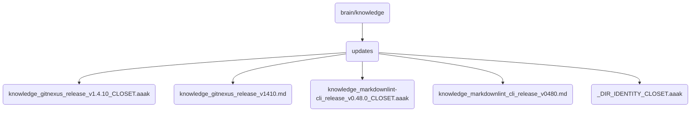

# Updates Identity

Contains release notes and updates for various components of OmniClaw v5.0.

## Topological View

```mermaid
graph TD
  Parent("brain/knowledge") --> Node("updates")
  Node --> Sub1("knowledge_gitnexus_release_v1.4.10_CLOSET.aaak")
  Node --> Sub2("knowledge_gitnexus_release_v1410.md")
  Node --> Sub3("knowledge_markdownlint-cli_release_v0.48.0_CLOSET.aaak")
  Node --> Sub4("knowledge_markdownlint_cli_release_v0480.md")
  Node --> Sub5("_DIR_IDENTITY_CLOSET.aaak")
```

---
*OmniClaw V5.0 | Forged by AI Architect | Evaluated dynamically*
