# xpfarm
Raw knowledge dump assimilated by OA.

## SWALLOW ENGINE DISTILLATION

### File: README.md
```md
# XPFarm

An open-source AI-augmented offensive security platform that wraps well-known security tools behind a unified web UI — with distributed scanning, AI-generated reports, a smart scan planner, an interactive attack graph, and a community Plugin SDK.

[](https://ko-fi.com/canuk40)

> Also check out [ObsidianBox Modern](https://play.google.com/store/apps/details?id=com.busyboxmodern.app&hl=en_CA) on Google Play.

---

### Index

| Section | Description |
|---|---|
| [Why](#why) | Motivation and philosophy |
| [Wrapped Tools](#wrapped-tools) | The 10 open-source tools orchestrated by XPFarm |
| [Architecture Map](#architecture-map) | Full system architecture, scan pipeline, data flow |
| [Overlord — AI Analysis](#overlord--ai-analysis) | AI agent for binary/malware/web analysis |
| [Bug Bounty Reports](#bug-bounty-reports) | AI-generated professional disclosure reports |
| [AI Scan Planner](#ai-scan-planner) | AI-optimized recon & exploitation step planner |
| [Distributed Workers](#distributed-workers) | Run scans across multiple machines in parallel |
| [Scan Graph](#scan-graph) | Interactive graph of assets, services, vulns, exploits |
| [Plugin SDK](#plugin-sdk) | Community-extensible Tool, Agent, and Pipeline system |
| [Finding Normalization Engine](#finding-normalization-engine) | Unified, enriched, deduplicated security findings |
| [What's New](#whats-new) | Recent security, reliability, and UX improvements |
| [Setup](#setup) | Build and deployment instructions |
| [TODO](#todo) | Planned features and roadmap |

---


---

## Why

Tools like [Assetnote](https://www.assetnote.io/) are great — well maintained, up to date, and transparent about vulnerability identification. But they're not open source. There's no need to reinvent the wheel either, as plenty of solid open-source tools already exist. XPFarm wraps them together so you can have a vulnerability scanner that's open source and less corporate.

The focus was on building a vuln scanner where you can see what fails or gets removed in the background, instead of wondering about the mystery. Everything the scan pipeline does is surfaced to the user.

---

## Wrapped Tools

- [Subfinder](https://github.com/projectdiscovery/subfinder) — subdomain discovery
- [Naabu](https://github.com/projectdiscovery/naabu) — port scanning
- [Httpx](https://github.com/projectdiscovery/httpx) — HTTP probing
- [Nuclei](https://github.com/projectdiscovery/nuclei) — vulnerability scanning
- [Nmap](https://nmap.org/) — network scanning
- [Katana](https://github.com/projectdiscovery/katana) — JS crawling
- [URLFinder](https://github.com/projectdiscovery/urlfinder) — URL discovery
- [Gowitness](https://github.com/sensepost/gowitness) — screenshots
- [Wappalyzer](https://github.com/projectdiscovery/wappalyzergo) — technology detection
- [CVEMap](https://github.com/projectdiscovery/cvemap) — CVE mapping


#### Credits

<table>
  <tr>
    <td align="center">
      <a href="https://github.com/Asjidkalam">
        <br/>
        <sub>Asjidkalam</sub>
      </a>
    </td>
    <td align="center">
      <a href="https://github.com/jamoski3112">
        <br/>
        <sub>jamoski3112</sub>
      </a><br/>
      <sub><a href="https://rahulr.in/reversing-a-cheap-ip-camera-to-root/">Research</a></sub>
    </td>
  </tr>
</table>

---

## Architecture Map

```mermaid
flowchart TB
    subgraph ENTRY["Entrypoint — main.go"]
        M1["Parse Flags (-debug)"]
        M2["InitDB — SQLite + WAL + GORM"]
        M3["InitModules — 10 tool wrappers"]
        M4["Load Plugins — normalization/all + plugins/all"]
        M5["Health Check — auto-install missing tools"]
        M6["CheckAndIndexTemplates — Nuclei versioning"]
        M7["StartServer — Gin on :8888"]
        M1 --> M2 --> M3 --> M4 --> M5 --> M6 --> M7
    end

    subgraph UI_LAYER["Web UI — internal/ui/server.go"]
        direction TB
        GIN["Gin HTTP Server\nEmbedded templates + static\nCSRF origin-check middleware"]

        subgraph Pages["HTML Pages"]
            P1["Dashboard — SSE live stage progress"]
            P2["Assets & Targets"]
            P3["Global Search — paginated + truncation"]
            P4["Scan Graph — Cytoscape.js"]
            P5["Bug Bounty Reports"]
            P6["AI Scan Planner"]
            P7["Workers & Jobs"]
            P8["Overlord Chat + Binary Upload"]
            P9["Modules"]
            P10["Settings — AES-256-GCM encrypted"]
        end

        GIN --> Pages
    end

    subgraph SCAN_ENGINE["Scan Engine — internal/core/"]
        direction TB
        SM["ScanManager\nSingleton, mutex-guarded\nPanic recovery + SSE broadcast"]

        subgraph PIPELINE["8-Stage Scanning Pipeline"]
            direction TB
            S1["1. Subfinder — Subdomain Discovery"]
            S2["2. Filter & Save — Cloudflare / Localhost / Alive"]
            S3["3. Naabu — Port Scanning (5-worker pool)"]
            S4["4. Nmap — Service + Version Detection"]
            S5["5. Httpx — HTTP Probing + Metadata"]
            S6["6. Parallel Web — Screenshots, Crawl, URLs, Tech"]
            S7["7. CVEMap — CVE lookup by product/tech"]
            S8["8. Nuclei — Vulnerability Scanning"]
            S1 --> S2 --> S3 --> S4 --> S5 --> S6 --> S7 --> S8
        end

        SM --> PIPELINE
    end

    subgraph REPORTS["Bug Bounty Reports — internal/reports/"]
        RG["GenerateReport()\nCollects DB context + graph\nOverlord AI generation\nFallback built-in templates"]
        RF["Formats: Markdown · PDF · HackerOne · Bugcrowd"]
        RS["Storage: internal/storage/reports/"]
        RG --> RF --> RS
    end

    subgraph PLANNER["AI Scan Planner — internal/planner/"]
        PL["GenerateScanPlan()\nGathers asset/finding/graph context\nPolls Overlord for JSON plan\nFallback heuristic plan"]
        PC["Capability Registry — 26 capabilities\n10 built-in modules + 16 Overlord agents\nRisk levels: safe / active / destructive"]
        PS["ExecutePlanWithLogs()\nSSE log streaming per step\nRoutes builtin vs Overlord agent steps"]
        PL --> PC --> PS
    end

    subgraph DISTRIBUTED["Distributed Workers — internal/distributed/"]
        DW["Worker Binary — cmd/worker/main.go\n./xpfarm-worker -controller http://host:8888"]
        DC["Controller — token auth, heartbeat monitor\nAtomically claims jobs from queue"]
        DS["Scheduler — BestWorkerForTool()\nRoutes by capability + active job count"]
        DJ["Job Queue — internal/storage/jobs/\nClaim via DB transaction, 30min timeout"]
        DW --> DC --> DS --> DJ
    end

    subgraph OVERLORD["Overlord — AI Agent Subsystem"]
        OV_PROXY["Overlord Proxy — internal/overlord/"]

        subgraph OV_AGENTS["22 Specialized Agents"]
            OA1["Binary RE — re-explorer, re-debugger, re-decompiler, re-scanner"]
            OA2["APK — apk-recon, apk-dynamic, apk-decompiler"]
            OA3["Web + Exploit — web-tester, re-exploiter, secrets-hunter, recon"]
        end

        subgraph OV_TOOLS["70+ TypeScript Tools"]
            OT1["radare2, ghidra, binwalk, frida, angr, strings"]
            OT2["semgrep, gitleaks, gau, corscanner, whatweb"]
            OT3["git_dumper, js_scraper, crypto_solver, ropper"]
        end

        subgraph PROVIDERS["21 AI Providers"]
            PR1["Anthropic · OpenAI · Groq · DeepSeek"]
            PR2["Ollama (local) · xAI · OpenRouter · Cerebras"]
        end

        OV_PROXY --> OV_AGENTS
        OV_PROXY --> OV_TOOLS
        OV_PROXY --> PROVIDERS
    end

    subgraph SCAN_GRAPH["Scan Graph — internal/graph/"]
        GB["BuildGraph() — queries 5 tables\nDeduplicates nodes + edges"]
        subgraph GNODES["Node Types"]
            GN1["asset #8b5cf6"]
            GN2["target #0ea5e9"]
            GN3["service #10b981"]
            GN4["tech #f59e0b"]
            GN5["vuln #ef4444"]
            GN6["exploit #dc2626"]
        end
        GB --> GNODES
    end

    subgraph DATABASE["Database — internal/database/ + internal/storage/"]
        DB["SQLite + WAL Mode\nGORM ORM\n10 open / 5 idle conns, 64MB WAL cap"]
        subgraph MODELS["Data Models"]
            DM1["Asset · Target · Port · WebAsset"]
            DM2["Vulnerability · CVE · ScanResult"]
            DM3["ScanProfile · NucleiTemplate · SavedSearch"]
            DM4["Setting (AES-256-GCM encrypted)"]
            DM5["Report · Plan · WorkerRecord · JobRecord"]
        end
        DB --> MODELS
    end

    subgraph DOCKER["Docker — docker-compose.yml"]
        DC1["xpfarm — Go app :8888"]
        DC2["overlord — OpenCode :3000"]
        DC3["mobsf — Mobile scan :8000 (optional)"]
        DC1 <-->|xpfarm-network| DC2
        DC1 <-->|xpfarm-network| DC3
    end

    M7 --> GIN
    GIN --> SCAN_ENGINE
    GIN --> REPORTS
    GIN --> PLANNER
    GIN --> DISTRIBUTED
    GIN --> OVERLORD
    GIN --> SCAN_GRAPH
    GIN --> DATABASE
```



---

## Overlord — AI Analysis

Overlord is a built-in AI agent powered by [OpenCode](https://opencode.ai) that can analyze binaries, archives, APKs, and web targets. Upload a file and chat with it — the agent uses radare2, strings, file triage, Frida, and more to investigate your target.

- **Live streaming output** — see thinking, tool calls, and results as they happen
- **Session history** — switch between previous sessions, auto-restored on page refresh
- **Multi-provider** — Anthropic, OpenAI, Groq, Ollama (local), DeepSeek, xAI, and 15+ more
- **Stop button** — abort long-running analysis at any time
- **70+ TypeScript tools** — radare2, Ghidra, Frida, binwalk, angr, Semgrep, Gitleaks, and more
- **22 specialized agents** — binary RE, APK analysis, web testing, exploit generation, secrets hunting
- **500 MB upload cap** with MIME type validation


---

## Bug Bounty Reports


Generate professional disclosure reports from your scan findings with a single click. Overlord AI synthesizes your asset inventory, vulnerability findings, graph context, and CVE data into a polished report.

**Formats:**

| Format | Output |
|---|---|
| `Markdown` | Clean `.md` with executive summary, findings table, remediation |
| `PDF` | Rendered via wkhtmltopdf, falls back to HTML |
| `HackerOne` | Platform-optimized structure with CVSS, reproduction steps |
| `Bugcrowd` | Title, severity, VRT category, impact, PoC |

**How it works:**
1. Select one or more assets to include
2. Choose format and optional title
3. Overlord AI generates a structured report from your live findings + attack graph
4. Download as `.md`, `.html`, or `.pdf` — or copy the raw Markdown
5. Reports are saved and can be re-downloaded at any time

---

## AI Scan Planner


Overlord selects the optimal recon and exploitation steps for your targets based on what's already been discovered — asset inventory, existing findings, graph structure, and available tool capabilities.

**Modes:**

| Mode | What it plans |
|---|---|
| `Full` | All 26 capabilities — complete assessment |
| `Recon` | Subdomain, port, HTTP, tech discovery only |
| `Web` | HTTP probing, crawling, web vulnerability checks |
| `Binary` | Overlord binary/APK/malware analysis agents |
| `Safe` | Zero-risk read-only tools only |

**How it works:**
1. Select target assets, mode, and step limits
2. Overlord AI analyses your existing data and generates a prioritized JSON plan
3. Each step shows: tool/agent, target, reasoning, and expected output
4. Click **Execute** to run the plan — steps stream live progress via SSE
5. Plans are saved and re-executable at any time

**Capability registry:** 10 built-in modules + 16 Overlord agents, each tagged with risk level (`safe` / `active` / `destructive`) and category for mode filtering.

---

## Distributed Workers


Run scans across multiple machines in parallel. Deploy worker nodes on remote hosts and they automatically register with the controller, poll for jobs, execute tools locally, and post results back.

**Deploy a worker:**

```bash
./xpfarm-worker -controller http://xpfarm-host:8888 -id worker-1 -labels high-bandwidth,internal
```

**How it works:**
- Workers register with a crypto token (32-byte random, one per worker)
- Heartbeat every 10 seconds — workers marked offline after 45s silence
- Jobs claimed atomically via DB transaction — no double-execution
- Scheduler routes jobs to the best available worker by capability and load
- 30-minute timeout per job; failed jobs are re-queued on worker disconnect

**Job queue:** Create jobs from the Workers UI or via `POST /api/jobs/create`. The queue shows live status, assigned worker, and result output.

---

## Scan Graph


XPFarm builds a unified directed graph of every entity discovered during scanning, making it trivial to answer questions like _"what services are running tech with an active CVE exploit?"_ or _"show me everything reachable from this asset"_.

**Node types:**

| Node | Color | Populated from |
|---|---|---|
| `asset` | purple `#8b5cf6` | Asset table |
| `target` | blue `#0ea5e9` | Target table |
| `service` | green `#10b981` | Port table (open ports) |
| `tech` | amber `#f59e0b` | WebAsset.TechStack + Port.Product |
| `vuln` | red `#ef4444` | Vulnerability + CVE tables |
| `exploit` | dark-red `#dc2626` | CVEs with `IsKEV=true` AND `HasPOC=true` |

**Example path:**

```
example.com (asset)
  └─owns──► www.example.com (target)
              ├─exposes──► 443/tcp https (service)
              │              └─runs──► nginx 1.24 (tech)
              ├─affected-by──► CVE-2023-44487 (vuln)
              │                   └─exploits──► Exploit: CVE-2023-44487
              └─affected-by──► http-missing-security-headers (vuln)
```

- Full-page interactive Cytoscape.js canvas — zoom, pan, drag nodes
- Left panel: filter by node type, vuln severity, edge kind
- Click any node → side panel shows all properties + deep-link to detail page
- "Rebuild Graph" re-queries the live database

---

## Plugin SDK

XPFarm is extensible via a community Plugin SDK. Anyone can add new Tools, Agents, and Pipelines without touching core code.

```
plugins/
├── all/all.go                    ← add your plugin import here
├── example-echo/                 ← minimal starter template
├── example-repo-scanner/         ← mock repo scanner example
├── repo-semgrep/                 ← Semgrep SAST plugin (production-ready)
└── repo-secrets/                 ← Gitleaks + SecretFinder plugin (production-ready)
```

**Writing a plugin — three steps:**
1. Create `plugins/my-p
... [TRUNCATED]
```

### File: CLAUDE.md
```md
# CLAUDE.md

This file provides guidance to Claude Code (claude.ai/code) when working with code in this repository.

## What This Is

**XPFarm** is a Go-based vulnerability scanner that wraps 10+ open-source security tools (Subfinder, Naabu, Httpx, Nuclei, Nmap, CVEMap, Gowitness, Katana, URLFinder, Wappalyzer) behind a unified web UI on port `:8888`. It also ships an AI binary/malware analysis agent called **Overlord**, backed by OpenCode running in a separate Docker container on port `:3000`.

## Build & Run Commands

```bash
# Full stack (recommended for development)
./xpfarm.sh build          # Build Docker containers
./xpfarm.sh up             # Start full stack (xpfarm + overlord + optional mobsf)
./xpfarm.sh down           # Stop containers

# Go only (skips Overlord, faster iteration)
./xpfarm.sh onlyGo         # Compile and run binary natively
./xpfarm.sh onlyGo -debug  # Same with debug logging + Gin debug mode

# Direct Go build
go build -o xpfarm main.go
```

There are no automated tests or linting configurations in this project.

## Architecture

### Entry Point & Startup Sequence (`main.go`)
1. Parse flags (`-debug`)
2. Initialize SQLite database (WAL mode, single connection, 30s timeout, 64MB cache)
3. Register 10 tool modules via the module registry
4. Health-check + auto-install missing tools
5. Index Nuclei templates in background goroutine
6. Start Gin web server on `:8888`

### Internal Package Layout

| Package | Role |
|---|---|
| `internal/core/` | 8-stage scan pipeline (`manager.go`), target resolution, Nuclei template plan engine, global search |
| `internal/database/` | SQLite models via GORM — 11 tables |
| `internal/modules/` | Pluggable tool wrappers + registry |
| `internal/ui/` | Gin server, REST API, embedded HTML templates |
| `internal/overlord/` | Reverse proxy to OpenCode serve API + SSE streaming |
| `internal/notifications/` | Discord & Telegram callbacks on scan lifecycle |
| `pkg/utils/` | Logger, Cloudflare IP detector, binary resolver, target helpers |

### 8-Stage Scan Pipeline (`internal/core/manager.go`)

```
1. Subfinder       → subdomain enumeration
2. Filter & Save   → resolve, Cloudflare/localhost check, alive status
3. Naabu           → port scanning (5-worker pool via Go channels)
4. Nmap            → service/version detection
5. Httpx           → HTTP probing + metadata
6. Parallel Web    → Gowitness (screenshots) + Katana (crawl) + URLFinder + Wappalyzer
7. CVEMap          → CVE lookup by detected product/version
8. Nuclei          → vuln scanning with smart template plan engine
```

### Database Domain Model

```
Asset
  └── Target (IP / domain / URL / CIDR)
        ├── Port         (service, product, version)
        ├── WebAsset     (URL, title, tech stack, screenshot, Katana output)
        ├── Vulnerability (Nuclei findings)
        ├── CVE          (CVSS, EPSS, KEV)
        └── ScanResult   (raw tool output)

ScanProfile    — per-asset feature toggles (port/web/vuln scope)
NucleiTemplate — indexed templates with version tracking
SavedSearch    — user regex-based search presets
Setting        — key-value config store
```

**Critical:** SQLite is configured with a single writer connection to prevent "database is locked" errors during concurrent scans. Never open additional write connections.

### Module Interface

Every tool wrapper in `internal/modules/` implements:

```go
Name() string
Description() string
CheckInstalled() bool
Install() error
Run(ctx context.Context, target string) (string, error)
```

New tools must be registered in the module registry and will be auto-installed on startup if missing.

### Overlord (AI Agent)

Overlord is a separate Docker service running OpenCode with 15+ specialized agents (binary RE, APK analysis, web, etc.) plus 70+ tools (radare2, Frida, binwalk, angr, etc.). The Go app proxies `/api/overlord/*` requests and SSE streams to it. The `overlord/` directory contains the Dockerfile, agent definitions (`overlord/agents/`), and TypeScript tools (`overlord/tools/`).

### Embedded Assets

Web UI templates and static files are embedded into the Go binary via `//go:embed`. When modifying templates in `internal/ui/templates/` or static files, rebuild the binary to pick up changes.

### Notifications

`ScanManager` accepts `SetOnStart` / `SetOnStop` callbacks. Discord and Telegram bots hook into these. Credentials come from the `settings` DB table (configured via the Settings UI page).

## Docker Compose Services

| Service | Port | Purpose |
|---|---|---|
| `xpfarm` | 8888 | Main Go app |
| `overlord` | 3000 | OpenCode AI agent (binary/malware analysis) |
| `mobsf` | 8000 | Mobile Security Framework (optional profile) |

Persistent volumes: `data/`, `screenshots/`, `overlord/binaries/`, `overlord/output/`, `overlord/config/`

## Key Flags

- `-debug` — enables verbose logging and Gin debug mode
- `-up` — runs `projectdiscovery` tool updates on startup

```

### File: main.go
```go
package main

import (
	"flag"
	"log"
	"os"

	"xpfarm/internal/core"
	"xpfarm/internal/database"
	"xpfarm/internal/mcp"
	"xpfarm/internal/modules"
	"xpfarm/internal/plugin"
	"xpfarm/internal/ui"
	graphstore "xpfarm/internal/storage/graph"
	reportstore "xpfarm/internal/storage/reports"
	planstore "xpfarm/internal/storage/plans"
	workerstore "xpfarm/internal/storage/workers"
	jobstore "xpfarm/internal/storage/jobs"
	schedulestore "xpfarm/internal/storage/schedules"
	scanhistorystore "xpfarm/internal/storage/scanhistory"
	"xpfarm/pkg/utils"

	_ "xpfarm/internal/normalization/all" // register all adapters + enrichers
	_ "xpfarm/plugins/all"               // compile-in all plugins via init()

	"github.com/gin-gonic/gin"
)

func main() {
	// Parse Flags
	debugMode := flag.Bool("debug", false, "Enable debug mode")
	flag.Parse()

	// Configure Logging
	utils.SetDebug(*debugMode)

	// Configure Gin Mode
	if *debugMode {
		gin.SetMode(gin.DebugMode)
	} else {
		gin.SetMode(gin.ReleaseMode)
	}

	banner := `
____  ________________________                     
╲   ╲╱  ╱╲______   ╲_   _____╱____ _______  _____  
 ╲     ╱  │     ___╱│    __) ╲__  ╲╲_  __ ╲╱     ╲ 
 ╱     ╲  │    │    │     ╲   ╱ __ ╲│  │ ╲╱  y y  ╲
╱___╱╲  ╲ │____│    ╲___  ╱  (____  ╱__│  │__│_│  ╱
      ╲_╱               ╲╱        ╲╱            ╲╱ 
                                github.com/A3-N
                            ` + "\x1b[3m" + `bugs, bounties & b*tchz` + "\x1b[0m" + `
`
	utils.PrintGradient(banner)

	// 0. Environment Setup
	// utils.EnsureGoBinPath() - REMOVED per user request

	// 1. Initialize Database
	utils.LogInfo("Initializing Database...")
	database.InitDB(*debugMode)
	if err := graphstore.Migrate(database.GetDB()); err != nil {
		log.Fatalf("failed to migrate graph tables: %v", err)
	}
	if err := reportstore.Migrate(database.GetDB()); err != nil {
		log.Fatalf("failed to migrate report tables: %v", err)
	}
	if err := planstore.Migrate(database.GetDB()); err != nil {
		log.Fatalf("failed to migrate plan tables: %v", err)
	}
	if err := workerstore.Migrate(database.GetDB()); err != nil {
		log.Fatalf("failed to migrate worker tables: %v", err)
	}
	if err := jobstore.Migrate(database.GetDB()); err != nil {
		log.Fatalf("failed to migrate job tables: %v", err)
	}
	if err := schedulestore.Migrate(database.GetDB()); err != nil {
		log.Fatalf("failed to migrate schedule tables: %v", err)
	}
	if err := scanhistorystore.Migrate(database.GetDB()); err != nil {
		log.Fatalf("failed to migrate scan history tables: %v", err)
	}

	// 2. Register built-in modules
	modules.InitModules()

	// 2b. Log loaded plugins (registered via init() in plugins/all)
	pluginTools := plugin.AllTools()
	pluginAgents := plugin.AllAgents()
	pluginPipelines := plugin.AllPipelines()
	utils.LogInfo("Plugin SDK: %d tool(s), %d agent(s), %d pipeline(s) loaded",
		len(pluginTools), len(pluginAgents), len(pluginPipelines))

	// 3. Health Checks & Installation
	utils.LogInfo("Checking Dependencies...")
	allModules := modules.GetAll()
	missingCount := 0

	for _, mod := range allModules {
		if !mod.CheckInstalled() {
			// Specific bypass for Nmap as it is not a Go binary and cannot be auto-installed
			if mod.Name() == "nmap" {
				utils.LogWarning("Tool %s not found. Please install Nmap manually and ensure it is in your PATH.", utils.Bold("nmap"))
				continue
			}

			utils.LogWarning("Tool %s not found. Attempting install...", utils.Bold(mod.Name()))
			if err := mod.Install(); err != nil {
				utils.LogError("Failed to install %s: %v", utils.Bold(mod.Name()), err)
				missingCount++
			} else {
				utils.LogSuccess("Successfully installed %s", utils.Bold(mod.Name()))
			}
		}
	}

	if missingCount > 0 {
		utils.LogError("%d tools failed to install. The tool might not function correctly.", missingCount)
		// We can decide to exit here or continue.
		// User said "if it fails it will error out".
		utils.LogError("Exiting due to missing dependencies.")
		os.Exit(1)
	}

	utils.LogSuccess("%s", utils.Bold("All dependencies satisfied."))

	// 4. Check for Updates
	modules.RunUpdates()

	// 5. Check and Index Nuclei Templates
	utils.LogInfo("Checking Nuclei Templates version...")
	go core.CheckAndIndexTemplates(database.GetDB())

	// 5b. Start MCP server (port 8889) for AI client integration
	go mcp.StartMCPServer(database.GetDB())

	// 6. Start Web Server
	port := "8888"
	utils.LogSuccess("Starting Web Interface on port %s...", utils.Bold(port))
	utils.LogSuccess("Access at %s", utils.Bold("http://localhost:"+port))

	// Enable Silent Mode (suppress further Info/Success logs to keep terminal clean for bars)
	if !*debugMode {
		utils.SetSilent(true)
	}

	// Open browser? Maybe later.

	if err := ui.StartServer(port); err != nil {
		log.Fatalf("Failed to start server: %v", err)
	}
}

```

### File: ROADMAP.md
```md
# XPFarm — 10-Year Leap Roadmap
**Research Date:** March 2026
**Scope:** 10 research areas, 50+ GitHub repos, 30+ web sources, 15+ arXiv papers
**Goal:** Identify every available lever to make XPFarm a decade ahead of comparable tools

---

## Table of Contents
1. [Executive Summary](#executive-summary)
2. [The 3 Paradigm Shifts](#the-3-paradigm-shifts)
3. [Top 15 Game-Changing Ideas](#top-15-game-changing-ideas)
4. [Quick Wins (1–3 Days)](#quick-wins-13-days)
5. [Moonshots (Category-Defining)](#moonshots-category-defining)
6. [Framework Comparison](#framework-comparison)
7. [Integration Catalog](#integration-catalog)
8. [Key Research Papers](#key-research-papers)
9. [Competitive Landscape](#competitive-landscape)
10. [Implementation Step-by-Steps](#implementation-step-by-steps)
11. [All Source Material](#all-source-material)

---
## Implementation Progress

| Item | Status | Commit |
|---|---|---|
| QW1: EPSS Score Enrichment | ✅ Done | 99f4f92 |
| QW2: VulnCheck KEV | ✅ Done | 99f4f92 |
| QW3: GreyNoise IP Filtering | ✅ Done | 99f4f92 |
| QW4: Screenshot Vision Analysis | ✅ Done | 99f4f92 |
| #3: Compound Risk Scoring | ✅ Done | 99f4f92 |
| #9: Vision Analysis | ✅ Done | 99f4f92 |
| #2: Passive Enrichment (GreyNoise) | ✅ Partial | 99f4f92 |
| QW5: CISA KEV Nuclei Targeting | ✅ Done | fb28748 |
| QW6: OSV.dev Dependency Vulns | ✅ Done | fb28748 |
| QW7: Shodan InternetDB passive recon | ✅ Done | fb28748 |
| QW8: LLM Auto-Report | ✅ Done | current |
| #1: LLM False-Positive Triage | ✅ Done | current |
| #4: MCP Server | ✅ Done | current |
| #15: Executive Report Generation | ✅ Done (wired into QW8) | current |
| #2: Shodan (full via InternetDB) | ✅ Done | fb28748 |
| #5: ReAct Agent Loop | ⏳ Pending | — |
| #6: AI Nuclei Template Generation | ✅ Done | current |
| #7: Attack Graph Visualization | ⏳ Pending (graph pkg exists) | — |
| #10: Exploit Chain Discovery | ⏳ Pending | — |
| #12: Chat Interface | ✅ Done | current |
| #13: CVE Semantic Embeddings | ⏳ Pending | — |
| #14: Authenticated Scanning | ⏳ Pending | — |
| MS1: Autonomous Agent Loop | ⏳ Moonshot | — |
| MS2: Distributed Scan Mesh | ⏳ Moonshot | — |
| MS3: Vuln Reproduction Sandbox | ⏳ Moonshot | — |
| MS4: BloodHound External Graph | ⏳ Moonshot | — |
| MS5: AI Co-Pilot with Memory | ⏳ Moonshot | — |


## Executive Summary

Three paradigm shifts are immediately available to XPFarm:

**1. MCP-Native AI Orchestration over Closed Pipelines.**
The security tooling world has converged on Model Context Protocol as the universal bridge between LLMs and offensive tools. Projects like HexStrike AI (7.7k stars) expose 150+ tools via MCP; PentestAgent (1.8k stars) both consumes and exposes itself as an MCP server with self-spawning child agents. XPFarm's 8-stage linear pipeline could be transformed into an AI-directed graph of tool invocations where the LLM decides which stage runs next based on prior results — a fundamental shift from deterministic execution to adaptive reasoning.

**2. LLM-Powered False-Positive Triage and Exploit Chaining.**
Semgrep proved that LLM triage achieves 96% agreement with human security researchers, handling 60% of triage work automatically (based on 250k+ findings). This is directly applicable to Nuclei's notorious false-positive problem. Beyond filtering, the frontier has moved to chaining: GPT-4 exploited 87% of 15 one-day CVEs autonomously (arXiv:2404.08144), and tools like PentAGI (13.6k stars) build Neo4j-backed knowledge graphs linking CVEs into multi-step attack chains. XPFarm currently stops at finding individual vulnerabilities; the next generation chains them into executable attack paths.

**3. Passive Intelligence Enrichment Before Active Scanning.**
Enterprise ASM tools enrich targets before firing a single packet. Shodan/Censys/FOFA data via ProjectDiscovery's `uncover` (2.8k stars, 13 engines, Go library), GreyNoise noise filtering, EPSS v4 probability scoring (free API, daily updated), and VulnCheck KEV+NVD++ (Go SDK, 142% more KEVs than CISA) can transform XPFarm's scan from "fire Naabu at everything" into a risk-ranked, pre-enriched assault surface that makes each active probe count.

---

## The 3 Paradigm Shifts

### Shift 1: LLM as Pipeline Director

**What it means:**
Replace the fixed 8-stage linear scan (`Subfinder → Naabu → Nmap → Httpx → Web → CVEMap → Nuclei`) with a ReAct (Reason+Act) loop. An LLM examines previous stage outputs and decides what to run next. If Httpx reveals a login page, it spawns credential-stuffing templates. If CVEMap finds Log4Shell-family CVE, it immediately runs targeted Nuclei templates before finishing the full scan.

**Why now:**
- PentAGI (13.6k ⭐): Go backend + Neo4j knowledge graph + multi-LLM orchestration
- PentestGPT (12.2k ⭐, USENIX Security 2024): 86.5% CTF benchmark success using conversational guidance
- arXiv:2404.08144: GPT-4 exploits 87% of CVEs autonomously when given the CVE description
- arXiv:2412.01778 (HackSynth): Planner+Summarizer dual-module architecture for iterative attack

**XPFarm gap:** Runs every stage always, even when earlier results indicate irrelevance. Adaptive execution cuts scan time 40–60% and increases finding quality.

---

### Shift 2: False-Positive Triage + Risk Prioritization

**What it means:**
After Nuclei runs, pipe findings through an LLM with the raw HTTP request/response, template YAML, and CVE context. The LLM classifies each finding as confirmed/likely/unlikely/false-positive. Combine with EPSS v4 (exploit probability) and VulnCheck KEV (known exploited vulnerabilities) to rank findings by actual risk.

**Why now:**
- Semgrep LLM triage: 96% agreement with human researchers on 250k+ findings (2025 blog post)
- EPSS v4 launched March 2025: per-CVE 30-day exploitation probability from FIRST.org, free API
- VulnCheck KEV: 142% more entries than CISA KEV, free community tier, official Go SDK
- CORTEX multi-agent alert triage (arXiv:2510.00311): multi-agent debate improves triage accuracy

**XPFarm gap:** Shows all Nuclei findings flat with no prioritization. Security analysts waste hours triaging noise.

---

### Shift 3: Passive Intelligence Before Active Scanning

**What it means:**
Before Naabu fires a single SYN packet, query passive data sources. `uncover` hits 13 engines simultaneously (Shodan, Censys, FOFA, ZoomEye, CriminalIP, etc.) to get pre-existing port/banner data. GreyNoise tags IPs as scanner bots/honeypots to skip. Shodan InternetDB provides free no-auth port data for any IP.

**Why now:**
- ProjectDiscovery `uncover` (2.8k ⭐): pure Go library, MIT license, 13 passive engines
- GreyNoise v3 API: `/v3/community/{ip}` is free, classifies IPs as scanner/benign/malicious
- Shodan InternetDB: `https://internetdb.shodan.io/{ip}` — completely free, no API key, instant results
- Enterprise ASM (Tenable, Qualys, Rapid7) all do this as table stakes

**XPFarm gap:** Zero passive enrichment. Every scan fires blind.

---

## Top 15 Game-Changing Ideas

### Ranked by Impact × Feasibility

---

### #1 — LLM False-Positive Triage Layer for Nuclei Output — **NEXT**

**What:**
After Nuclei runs, pipe every finding through an LLM (Claude/GPT-4o) with:
- Raw HTTP request and response from the finding
- The Nuclei template YAML
- CVE description (if applicable)
- Few-shot examples from previously validated findings (RAG)

LLM classifies: `confirmed` / `likely` / `unlikely` / `false-positive` with a 0.0–1.0 confidence score and a reasoning string.

**Why it matters:**
Nuclei's false-positive rate on template-heavy scans can exceed 30%. Semgrep achieves 96% triage accuracy. XPFarm currently shows all Nuclei output with zero prioritization.

**Effort:** M (1–2 weeks)

**Implementation in XPFarm:**
1. Add `triage_confidence FLOAT`, `triage_verdict TEXT`, `triage_reasoning TEXT` columns to `Vulnerability` model in `internal/database/models.go`
2. Create `internal/core/triage.go` with a `TriageVulnerability(v *Vulnerability, apiKey string) error` function
3. Build a prompt: `[template YAML]\n[HTTP request]\n[HTTP response]\n[CVE description]\nAnalyze this finding and return JSON: {"verdict": "confirmed|likely|unlikely|false_positive", "confidence": 0.0-1.0, "reasoning": "..."}`
4. Call Anthropic or OpenAI API in batches of 10 (parallel goroutines with rate limiting)
5. Add stage 8.5 in `manager.go`: after Nuclei, call triage for each finding
6. Surface in UI as colored confidence badges: red=confirmed, orange=likely, gray=fp

**References:**
- Semgrep 96% accuracy: https://semgrep.dev/blog/2025/building-an-appsec-ai-that-security-researchers-agree-with-96-of-the-time/
- CORTEX multi-agent triage: https://arxiv.org/html/2510.00311v1

---

### ~~#2 — Passive Intelligence Pre-Enrichment (GreyNoise)~~ ✅ PARTIAL — GreyNoise DONE; Shodan InternetDB + uncover remaining

**What:**
Before any active scanning, run a Stage 0 that:
1. Queries `uncover` across 13 passive engines for existing port/banner data
2. Queries GreyNoise for each resolved IP — skip scanner bots and honeypots
3. Queries Shodan InternetDB for free port data (no API key needed)
4. Merges into a `PassiveRecon` table, feeds known-open ports to Naabu skip-list

**Why it matters:**
Naabu SYN scanning against large CIDRs is noisy and slow. Passive data makes active scans surgical. Enterprise ASM does this by default. XPFarm currently has zero passive enrichment.

**Effort:** M (1 week)

**Implementation in XPFarm:**
1. Add `go get github.com/projectdiscovery/uncover` to go.mod
2. Create `internal/core/passive.go` with `RunPassiveRecon(targets []string) []PassiveResult`
3. Call `https://internetdb.shodan.io/{ip}` for each resolved IP (free, no key): returns `{ports, hostnames, tags, vulns, cpes}`
4. Call `https://api.greynoise.io/v3/community/{ip}` with GreyNoise API key (free tier 50/day): filter out `classification: "benign"`
5. Create DB table: `passive_recon (id, target_id, source TEXT, port INT, protocol TEXT, banner TEXT, tags TEXT, retrieved_at DATETIME)`
6. In Stage 1 of manager.go, check `passive_recon` for already-known ports before running Naabu
7. Add `PassiveReconSummary` widget to target detail UI page

**API Endpoints:**
- Shodan InternetDB: `https://internetdb.shodan.io/{ip}` — completely free, no auth
- GreyNoise Community: `GET https://api.greynoise.io/v3/community/{ip}` — free tier, key from greynoise.io
- ProjectDiscovery uncover: `github.com/projectdiscovery/uncover` — Go library, wraps all engines

**References:**
- ProjectDiscovery uncover (2.8k ⭐): https://github.com/projectdiscovery/uncover
- GreyNoise API v3 docs: https://docs.greynoise.io/docs/using-the-greynoise-api
- VulnCheck Scanless article: https://www.vulncheck.com/blog/vulncheck-goes-scanless

---

### ~~#3 — EPSS + VulnCheck KEV Vulnerability Prioritization Engine~~ ✅ DONE (commit 99f4f92)

**What:**
Replace CVEMap as the CVE enrichment source with a compound scoring system:
- `risk_score = cvss_base * epss_score * kev_multiplier`
- EPSS v4 (free, daily updated, per-CVE 30-day exploit probability from FIRST.org)
- VulnCheck KEV (142% more entries than CISA KEV, Go SDK available)
- Sort all findings by `risk_score` by default in the UI
- Add CVSS vs EPSS risk matrix visualization widget

**Why it matters:**
CVSS 9.8 vulnerabilities that nobody exploits waste analyst time. CVEs in top EPSS percentile (>0.7) are actively being weaponized. VulnCheck NVD++ also fixes notorious NIST NVD API instability.

**Effort:** S (3–5 days)

**Implementation in XPFarm:**
1. Add to `internal/database/models.go` CVE model: `EpssScore float64`, `EpssPercentile float64`, `InVulncheckKev bool`, `InCisaKev bool`, `RiskScore float64`
2. Run `go get github.com/vulncheck-oss/sdk-go`
3. Create `internal/core/enrichment.go`:
   ```go
   func EnrichCVE(cveID string) (*CVEEnrichment, error) {
       // Call EPSS API
       resp, _ := http.Get("https://api.first.org/data/1.0/epss?cve=" + cveID)
       // Call VulnCheck community API
       // Compute risk_score
   }
   ```
4. In Stage 7 (CVEMap), after each CVE is stored, call `EnrichCVE` and update the record
5. Add CISA KEV JSON feed polling (daily cron): `https://www.cisa.gov/sites/default/files/feeds/known_exploited_vulnerabilities.json`
6. Update Findings UI: sort by risk_score, show EPSS badge (colored by percentile), KEV badge in red

**API Endpoints:**
- EPSS: `GET https://api.first.org/data/1.0/epss?cve=CVE-XXXX-XXXX` — free, no auth, returns score + percentile
- VulnCheck KEV: `GET https://api.vulncheck.com/v3/index/vulncheck-kev?cve=CVE-XXXX-XXXX` — community free tier
- CISA KEV feed: `https://www.cisa.gov/sites/default/files/feeds/known_exploited_vulnerabilities.json` — free JSON

**References:**
- EPSS API: https://www.first.org/epss/api
- VulnCheck Go SDK blog: https://www.vulncheck.com/blog/python-go-sdk
- VulnCheck NVD++: https://www.vulncheck.com/nvd2
- Go community EPSS example: https://rud.is/b/2024/03/23/vulnchecks-free-community-kev-cve-apis-code-golang-cli-utility/

---

### #4 — MCP Server: Expose XPFarm's Tools to Any AI Agent — **NEXT**

**What:**
Expose XPFarm's 10 tool modules as MCP (Model Context Protocol) tools so any MCP-compatible AI agent (Claude Desktop, Cursor, any LLM with MCP support) can invoke Subfinder, Nuclei, Httpx, etc. through XPFarm's unified interface. Also build a built-in MCP client so XPFarm's own Overlord AI calls its tools without HTTP round-trips.

**Why it matters:**
MCP is the de-facto protocol for AI↔tool integration in 2025. HexStrike AI (7.7k ⭐) built its entire product around this. Any serious AI security platform needs MCP — it's the API layer for the agentic future.

**Effort:** M (1–2 weeks)

**Implementation in XPFarm:**
1. `go get github.com/mark3labs/mcp-go`
2. Create `internal/mcp/server.go` — register each module as an MCP tool with JSON schema:
   ```go
   server.AddTool(mcp.Tool{
       Name: "subfinder",
       Description: "Enumerate subdomains for a domain",
       InputSchema: mcp.ToolInputSchema{
           Type: "object",
           Properties: map[string]interface{}{
               "domain": map[string]string{"type": "string"},
           },
       },
   }, subfinderHandler)
   ```
3. Expose via SSE transport at `/mcp/sse` and stdio transport for direct LLM use
4. Register MCP server on startup in `main.go` alongside existing Gin server
5. Update Overlord: replace HTTP proxy to OpenCode with native Go MCP client calling XPFarm's own tools
6. Document MCP endpoint in README so Claude Desktop / Cursor can connect

**References:**
- MCP for Security (592 ⭐): https://github.com/cyproxio/mcp-for-security
- HexStrike AI (7.7k ⭐, MCP-native): https://github.com/0x4m4/hexstrike-ai
- PentestMCP: https://github.com/ramkansal/pentestMCP
- mcp-go library: https://github.com/mark3labs/mcp-go

---

### #5 — ReAct/Reflexion Agent Loop Replacing Linear Pipeline

**What:**
Implement a ReAct (Reason+Act) orchestrator where an LLM serves as the pipeline director. The agent:
1. Receives scan scope and prior tool outputs
2. Reasons 
... [TRUNCATED]
```

### File: xpfarm-toggle.sh
```sh
#!/bin/bash
# XPFarm on/off toggle — works with both Docker stack and native binary.
# Updates the desktop icon to reflect current state (green=ON, red=OFF).

WORKDIR="/mnt/workspace/xpfarm"
DESKTOP_FILE="$HOME/Desktop/XPFarm.desktop"
ICON_ON="$WORKDIR/img/xpfarm-on.svg"
ICON_OFF="$WORKDIR/img/xpfarm-off.svg"
URL="http://localhost:8888"

cd "$WORKDIR"

# ── helpers ────────────────────────────────────────────────────────────────────

is_running() {
    # Docker container running?
    docker compose ps -q xpfarm 2>/dev/null | grep -q . && return 0
    # Native binary on port 8888?
    ss -tlnp 2>/dev/null | grep -q ':8888' && return 0
    return 1
}

set_icon() {
    local icon="$1"
    if [ -f "$DESKTOP_FILE" ]; then
        sed -i "s|^Icon=.*|Icon=$icon|" "$DESKTOP_FILE"
        gio set "$DESKTOP_FILE" metadata::trusted true 2>/dev/null || true
        chmod +x "$DESKTOP_FILE"
    fi
}

notify() {
    notify-send "$1" "$2" -i "$3" -t 4000 2>/dev/null || true
}

# ── main toggle ────────────────────────────────────────────────────────────────

if is_running; then
    # ── STOP ──────────────────────────────────────────────────────────────────
    notify "XPFarm" "Stopping..." "$ICON_ON"

    # Stop Docker stack if it's the one running
    docker compose ps -q xpfarm 2>/dev/null | grep -q . && ./xpfarm.sh down

    # Kill any stray native process on 8888
    NATIVE_PID=$(ss -tlnp 2>/dev/null | grep ':8888' | grep -oP 'pid=\K[0-9]+' | head -1)
    if [ -n "$NATIVE_PID" ]; then
        kill "$NATIVE_PID" 2>/dev/null || sudo kill "$NATIVE_PID" 2>/dev/null || true
        sleep 1
    fi

    set_icon "$ICON_OFF"
    notify "XPFarm" "Stopped." "$ICON_OFF"

else
    # ── START ─────────────────────────────────────────────────────────────────
    notify "XPFarm" "Starting stack..." "$ICON_OFF"

    ./xpfarm.sh up

    # Wait up to 30s for port 8888 to respond
    for i in $(seq 1 30); do
        sleep 1
        ss -tlnp 2>/dev/null | grep -q ':8888' && break
    done

    if is_running; then
        set_icon "$ICON_ON"
        notify "XPFarm" "Running at $URL" "$ICON_ON"
        xdg-open "$URL" 2>/dev/null || true
    else
        notify "XPFarm" "Failed to start — check logs." "$ICON_OFF"
    fi
fi

```

### File: xpfarm.ps1
```ps1
# XPFarm - Unified CLI
# Usage: .\xpfarm.ps1 [build|up|onlyGo|down|help]

param(
    [Parameter(Position = 0)]
    [string]$Command = "help",

    [Parameter(Position = 1, ValueFromRemainingArguments)]
    [string[]]$ExtraArgs
)

$ErrorActionPreference = "Stop"

function Show-Banner {
    Write-Host "`e[38;2;139;92;246m ____  ________________________                     `e[0m"
    Write-Host "`e[38;2;122;98;230m `u{2572}   `u{2572}`u{2571}  `u{2571}`u{2572}______   `u{2572}_   _____`u{2571}____ _______  _____  `e[0m"
    Write-Host "`e[38;2;105;110;214m  `u{2572}     `u{2571}  `u{2502}     ___`u{2571}`u{2502}    __) `u{2572}__  `u{2572}`u{2572}_  __ `u{2572}`u{2571}     `u{2572} `e[0m"
    Write-Host "`e[38;2;80;130;190m  `u{2571}     `u{2572}  `u{2502}    `u{2502}    `u{2502}     `u{2572}   `u{2571} __ `u{2572}`u{2502}  `u{2502} `u{2572}`u{2571}  y y  `u{2572}`e[0m"
    Write-Host "`e[38;2;48;158;163m `u{2571}___`u{2571}`u{2572}  `u{2572} `u{2502}____`u{2502}    `u{2572}___  `u{2571}  (____  `u{2571}__`u{2502}  `u{2502}__`u{2502}_`u{2502}  `u{2571}`e[0m"
    Write-Host "`e[38;2;16;185;129m       `u{2572}_`u{2571}               `u{2572}`u{2571}        `u{2572}`u{2571}            `u{2572}`u{2571} `e[0m"
    Write-Host "`e[38;2;16;185;129m                                    github.com/A3-N`e[0m"
}

function Assert-Docker {
    if (-not (Get-Command docker -ErrorAction SilentlyContinue)) {
        Write-Host "`e[1;31mError: Docker is not installed`e[0m"
        exit 1
    }
}


function Invoke-Build {
    Assert-Docker
    Show-Banner
    Write-Host "`e[1mBuilding XPFarm + Overlord containers...`e[0m"
    docker compose build
    Write-Host ""
    Write-Host "`e[1;32mBuild complete!`e[0m Run `e[1m.\xpfarm.ps1 up`e[0m to start."
}

function Invoke-Up {
    Assert-Docker
    Show-Banner

    # Ensure data directory exists
    if (-not (Test-Path "data")) {
        New-Item -ItemType Directory -Force -Path "data" | Out-Null
    }

    Write-Host "`e[1mStarting XPFarm + Overlord...`e[0m"
    docker compose up -d

    Write-Host "`e[1mWaiting for XPFarm web UI...`e[0m"
    while ($true) {
        try {
            $response = Invoke-WebRequest -Uri "http://localhost:8888" -UseBasicParsing -ErrorAction Stop
            break
        } catch {
            Start-Sleep -Seconds 2
        }
    }

    Write-Host ""
    Write-Host "`e[1;32mEnvironment is running and web UI is ready!`e[0m"
    Write-Host "  XPFarm:   `e[1mhttp://localhost:8888`e[0m"
    Write-Host "  Overlord: `e[1mRunning (internal)`e[0m"
    Write-Host ""
    docker compose ps
}

function Invoke-OnlyGo {
    param([string[]]$GoArgs = @())
    Show-Banner
    Write-Host "`e[1mBuilding XPFarm (Go native, no Docker)...`e[0m"
    Write-Host "`e[1mNote: Overlord features require Docker.`e[0m"
    Write-Host ""

    go build -o xpfarm.exe main.go
    Write-Host "`e[1;32mBuild complete. Starting...`e[0m"
    if ($GoArgs.Count -gt 0) {
        & .\xpfarm.exe @GoArgs
    } else {
        & .\xpfarm.exe
    }
}

function Invoke-Down {
    Assert-Docker
    Write-Host "`e[1mStopping all containers...`e[0m"
    docker compose down
    Write-Host "`e[1;32mEnvironment stopped.`e[0m"
}

function Show-Help {
    Show-Banner
    Write-Host "Usage: " -NoNewline
    Write-Host ".\xpfarm.ps1" -NoNewline -ForegroundColor White
    Write-Host " <command>"
    Write-Host ""
    Write-Host "Commands:"
    Write-Host "  build" -NoNewline -ForegroundColor White; Write-Host "       Build the Docker containers (XPFarm + Overlord)"
    Write-Host "  up" -NoNewline -ForegroundColor White; Write-Host "          Start the environment (docker compose up)"
    Write-Host "  onlyGo" -NoNewline -ForegroundColor White; Write-Host "      Compile and run Go binary directly (no Docker, no Overlord)"
    Write-Host "  down" -NoNewline -ForegroundColor White; Write-Host "        Stop all Docker containers"
    Write-Host "  help" -NoNewline -ForegroundColor White; Write-Host "        Show this help message"
    Write-Host ""
    Write-Host "Examples:"
    Write-Host "  .\xpfarm.ps1 build        # Build containers"
    Write-Host "  .\xpfarm.ps1 up           # Start full stack"
    Write-Host "  .\xpfarm.ps1 onlyGo       # Dev mode, Go only"
}

switch ($Command) {
    "build"    { Invoke-Build }
    "up"       { Invoke-Up }
    "onlyGo"   { Invoke-OnlyGo -GoArgs $ExtraArgs }
    "down"     { Invoke-Down }
    default    { Show-Help }
}

```

### File: xpfarm.sh
```sh
#!/bin/bash

# XPFarm - Unified CLI
# Usage: ./xpfarm.sh [build|up|onlyGo|down|help]

set -e

banner() {
    echo -e "\033[38;2;139;92;246m ____  ________________________                     \033[0m"
    echo -e "\033[38;2;122;98;230m \u2572   \u2572\u2571  \u2571\u2572______   \u2572_   _____\u2571____ _______  _____  \033[0m"
    echo -e "\033[38;2;105;110;214m  \u2572     \u2571  \u2502     ___\u2571\u2502    __) \u2572__  \u2572\u2572_  __ \u2572\u2571     \u2572 \033[0m"
    echo -e "\033[38;2;80;130;190m  \u2571     \u2572  \u2502    \u2502    \u2502     \u2572   \u2571 __ \u2572\u2502  \u2502 \u2572\u2571  y y  \u2572\033[0m"
    echo -e "\033[38;2;48;158;163m \u2571___\u2571\u2572  \u2572 \u2502____\u2502    \u2572___  \u2571  (____  \u2571__\u2502  \u2502__\u2502_\u2502  \u2571\033[0m"
    echo -e "\033[38;2;16;185;129m       \u2572_\u2571               \u2572\u2571        \u2572\u2571            \u2572\u2571 \033[0m"
    echo -e "\033[38;2;16;185;129m                                    github.com/A3-N\033[0m"
    echo ""
}

require_docker() {
    if ! command -v docker &> /dev/null; then
        echo -e "\033[1;31mError: Docker is not installed\033[0m"
        exit 1
    fi
}


cmd_build() {
    require_docker
    banner
    echo -e "\033[1mBuilding XPFarm + Overlord containers...\033[0m"
    docker compose build
    echo ""
    echo -e "\033[1;32mBuild complete!\033[0m Run \033[1m./xpfarm.sh up\033[0m to start."
}

cmd_up() {
    require_docker
    banner

    # Ensure data directory exists
    mkdir -p data

    echo -e "\033[1mStarting XPFarm + Overlord...\033[0m"
    docker compose up -d

    echo -e "\033[1mWaiting for XPFarm web UI...\033[0m"
    while ! curl -s http://localhost:8888/ > /dev/null; do
        sleep 2
    done

    echo ""
    echo -e "\033[1;32mEnvironment is running and web UI is ready!\033[0m"
    echo -e "  XPFarm:   \033[1mhttp://localhost:8888\033[0m"
    echo -e "  Overlord: \033[1mRunning (internal)\033[0m"
    echo ""
    docker compose ps
}

cmd_onlygo() {
    banner
    echo -e "\033[1mBuilding XPFarm (Go native, no Docker)...\033[0m"
    echo -e "\033[1mNote: Overlord features require Docker.\033[0m"
    echo ""

    go build -o xpfarm main.go
    echo -e "\033[1;32mBuild complete. Starting...\033[0m"
    ./xpfarm "$@"
}

cmd_down() {
    require_docker
    echo -e "\033[1mStopping all containers...\033[0m"
    docker compose down
    echo -e "\033[1;32mEnvironment stopped.\033[0m"
}

cmd_update() {
    require_docker
    banner
    echo -e "\033[1mRebuilding with @latest tool versions (opt-in upgrade)...\033[0m"
    echo -e "\033[33mThis pulls the latest version of each security tool.\033[0m"
    echo -e "\033[33mAfterward, update the ARG defaults in Dockerfile to lock in the new versions.\033[0m"
    echo ""
    docker compose build --no-cache \
        --build-arg SUBFINDER_VERSION=latest \
        --build-arg NAABU_VERSION=latest \
        --build-arg HTTPX_VERSION=latest \
        --build-arg KATANA_VERSION=latest \
        --build-arg UNCOVER_VERSION=latest \
        --build-arg URLFINDER_VERSION=latest \
        --build-arg NUCLEI_VERSION=latest \
        --build-arg CVEMAP_VERSION=latest \
        --build-arg GOWITNESS_VERSION=latest \
        --build-arg WAPPALYZER_VERSION=latest
    echo ""
    echo -e "\033[1;32mUpdate build complete!\033[0m"
    echo -e "Run \033[1m./xpfarm.sh up\033[0m to start with updated tools."
}

cmd_help() {
    banner
    echo -e "Usage: \033[1m./xpfarm.sh\033[0m <command>"
    echo ""
    echo "Commands:"
    echo -e "  \033[1mbuild\033[0m       Build the Docker containers (XPFarm + Overlord)"
    echo -e "  \033[1mup\033[0m          Start the environment (docker compose up)"
    echo -e "  \033[1monlyGo\033[0m      Compile and run Go binary directly (no Docker, no Overlord)"
    echo -e "  \033[1mdown\033[0m        Stop all Docker containers"
    echo -e "  \033[1mupdate\033[0m      Rebuild containers with @latest tool versions (opt-in upgrade)"
    echo -e "  \033[1mhelp\033[0m        Show this help message"
    echo ""
    echo "Examples:"
    echo -e "  ./xpfarm.sh build        # Build containers"
    echo -e "  ./xpfarm.sh up           # Start full stack"
    echo -e "  ./xpfarm.sh onlyGo       # Dev mode, Go only"
    echo -e "  ./xpfarm.sh update       # Upgrade all tools to latest"
}

case "${1:-help}" in
    build)    cmd_build ;;
    up)       cmd_up ;;
    onlyGo)   shift; cmd_onlygo "$@" ;;
    down)     cmd_down ;;
    update)   cmd_update ;;
    help|*)   cmd_help ;;
esac

```


> [!WARNING]
> Distillation threshold (50000 chars) reached. Truncating further files.
