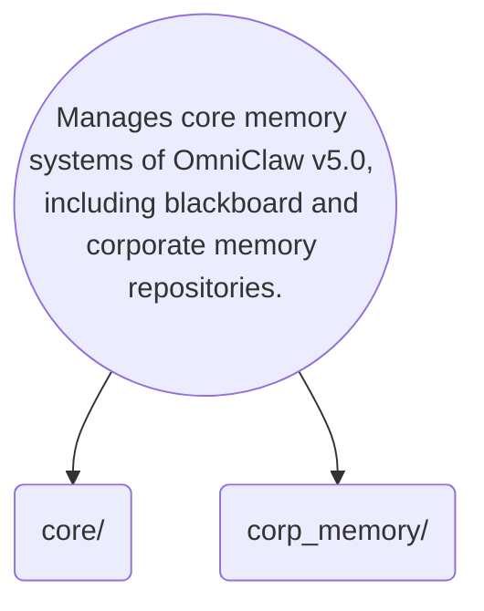

# Memory Identity

This directory manages the core memory systems of OmniClaw v5.0, including both the central blackboard and corporate memory repositories essential for knowledge sharing and decision-making across the AI OS.

## Topological View

---
*OmniClaw V5.0 | Forged by AI Architect | Evaluated dynamically*
