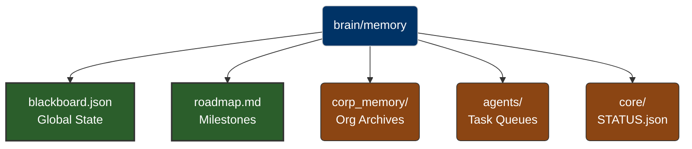

# `brain/memory` Identity (Active Memory State)

> [!CAUTION]  
> **OSF DAEMON SECURITY WATERMARK**  
> This directory contains live operational data, including the global Blackboard, system status, and agent task queues. 

## 1. Directory Purpose
Serves as the volatile and semi-persistent Short-Term Memory (STM) core of the OmniClaw system. All agents read, write, and synchronize their current work cycles against the states stored here.

## 2. Structural Topology

## 3. Compliance Rules
- This zone is highly dynamic. Data here changes frequently and is read continuously by AI boot protocols (e.g. `gemini.md`, `claude.md`).
- Legacy metadata identifying this folder as "Empty Shell (v2.1)" is permanently purged.
