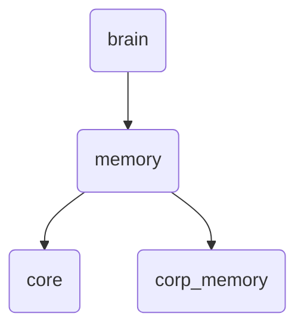

# Memory Identity

The 'memory' directory within OmniClaw v5.0 is responsible for managing and storing various types of memory, including core operations and corporate-specific memories.

---

## Topological View

---
*OmniClaw V5.0 | Forged by OMA AI Architect | brain.memory | 2026-04-10*
