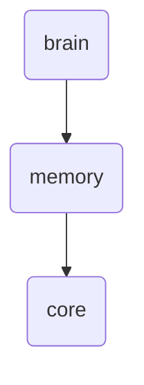

# Core Identity

The 'core' directory within OmniClaw v5.0's memory system is responsible for storing and managing the fundamental data structures that are essential for the operation of the brain module.

---

## Topological View

---
*OmniClaw V5.0 | Forged by OMA AI Architect | brain.memory.core | 2026-04-10*
