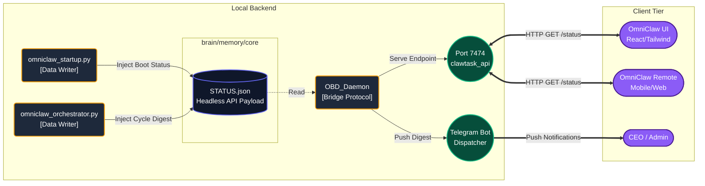

# `brain/memory/core` / [OBD_Telemetry_Vault]

> **[CLASSIFIED] █ █ █ █ █ █ █ █ █ █**
> **WATERMARK:** `// OMNICLAW_OS_V5.0 // CORE_TELEMETRY // OBD_BRIDGE //`
> **ACCESS LEVEL:** TIER-2 (DAEMONS ONLY)

This partition acts as the **Headless System A/B Bridge**. It holds rapidly changing JSON data stores (such as `STATUS.json`) written by the Orchestrator and retrieved exclusively via the `OBD_Daemon` (Bridge Protocol) for external UI consumption.

## 📡 Telemetry Topology (V5.0)

## Declarations
- **Strictly No Logic**: This directory MUST NOT contain `.py`, `.js`, or executable files.
- **V5 Constraint**: JSON keys must reflect physical paths (e.g., `"vault"` instead of legacy `"kho"`).
