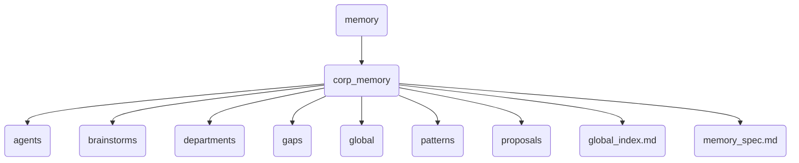

# Corp Memory Identity

The corp_memory directory serves as the central repository for corporate memory within OmniClaw, storing structured and unstructured data related to company knowledge, strategies, and historical records. It acts as a backbone for accessing and managing corporate information across various departments.

---

## Topological View

---
*OmniClaw V5.0 | Forged by OMA AI Architect | brain.memory.corp_memory | 2026-04-10*
