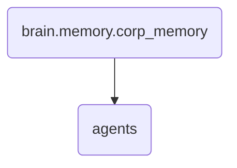

# Agents Identity

This directory houses the various agents and their associated knowledge templates within OmniClaw v5.0, facilitating the management of corporate memory through specialized roles such as backend architects, channel agents, and content intake vetting workers.

---

## Topological View

---
*OmniClaw V5.0 | Forged by OMA AI Architect | brain.memory.corp_memory.agents | 2026-04-10*
