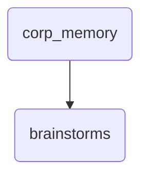

# Brainstorms Identity

This directory serves as a brainstorming space for corporate memory within OmniClaw, facilitating the generation and storage of innovative ideas.

---

## Topological View

---
*OmniClaw V5.0 | Forged by OMA AI Architect | brain.memory.corp_memory.brainstorms | 2026-04-10*
