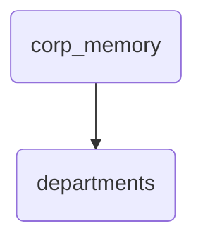

# Departments Identity

This directory contains the organizational structure of departments within OmniClaw, defining their roles and responsibilities.

---

## Topological View

---
*OmniClaw V5.0 | Forged by OMA AI Architect | brain.memory.corp_memory.departments | 2026-04-10*
