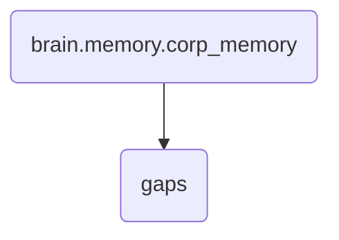

# Gaps Identity

This directory contains the template for generating gap reports, which are crucial for identifying and addressing knowledge gaps within the company's memory system.

---

## Topological View

---
*OmniClaw V5.0 | Forged by OMA AI Architect | brain.memory.corp_memory.gaps | 2026-04-10*
