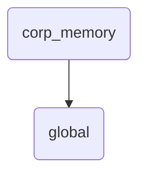

# Global Identity

This directory serves as the central repository for global corporate memory, storing information relevant to all departments and teams within OmniClaw.

---

## Topological View

---
*OmniClaw V5.0 | Forged by OMA AI Architect | brain.memory.corp_memory.global | 2026-04-10*
