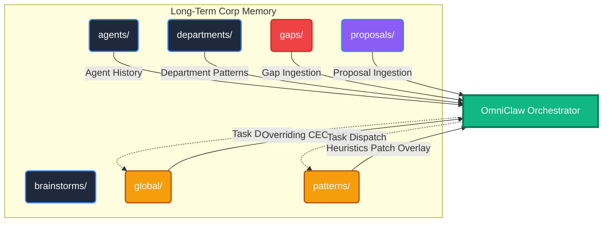

# MEMORY_SPEC.md — OmniClaw Unified Memory Architecture

# Version: 5.0 | Updated: 2026-04-10
# Authority: Tier 4 (Data & Memory)

## 🧠 Long-Term Episodic Engine (System B - V5.0)

OmniClaw currently utilizes the **Unified Memory Framework V5.0**:
- **Short-term Memory (System A)**: `brain/memory/` designated for ultra-fast, real-time IO (`blackboard.json`).
- **Long-term Memory (System B)**: `brain/memory/corp_memory/` designated for permanent, narrative, and log-based storage in Markdown format for RAG ingestion and Orchestrator Automated Workflows.

This specification outlines the operational rules for **Long-term Memory (System B)** based on the 8-Daemon Architecture modernization.

### 1. The Autonomous Tiers
| Directory | Owner | Workflow Hook |
| --------- | ----- | ------------- |
| `global/` | CEO | Unconditional Supreme Context (Top-down) |
| `patterns/` | Agents | Dynamic Adaptive Overlays (System-wide heuristics patch) |
| `gaps/` | Agents | Orchestrator self-healing ingestion (Promotes `Refactoring` tasks) |
| `proposals/` | CEO | Orchestrator inbox ingestion (Promotes `Setup` tasks upon `[x] APPROVE`) |

### 2. The Organizational Tiers
| Directory | Owner | Purpose |
| --------- | ----- | ------- |
| `departments/` | Dept Heads | High-level 30-day institutional memory. Aggregates overarching rules mapping to entire teams. |
| `agents/` | Native Agents | Granular task history. 7-day auto-purged individual alignment files. |
| `brainstorms/` | Cross-Functional | Volatile idea dumping grounds. |

---
