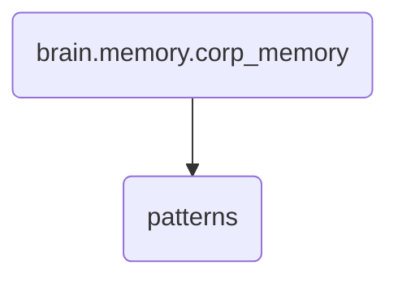

# Patterns Identity

This directory contains system heuristics used for pattern recognition and analysis within OmniClaw. It plays a crucial role in enhancing the decision-making capabilities of the system.

---

## Topological View

---
*OmniClaw V5.0 | Forged by OMA AI Architect | brain.memory.corp_memory.patterns | 2026-04-10*
