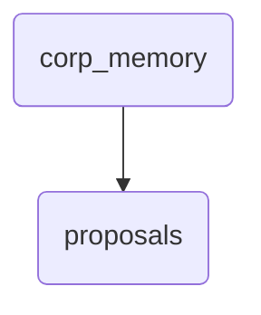

# Proposals Identity

This directory holds various proposal documents and templates, including specific proposals for observability layer enhancements and a general template. It serves as the central repository for strategic planning within OmniClaw.

---

## Topological View

---
*OmniClaw V5.0 | Forged by OMA AI Architect | brain.memory.corp_memory.proposals | 2026-04-10*
