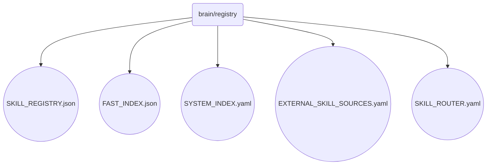

# Registry Identity

The brain/registry directory manages the core components of the OmniClaw v5.0 AI operating system, including skill sources, indexations, and routing configurations that ensure seamless integration and execution across all agents.

## Topological View

---
*OmniClaw V5.0 | Forged by AI Architect | Evaluated dynamically*
