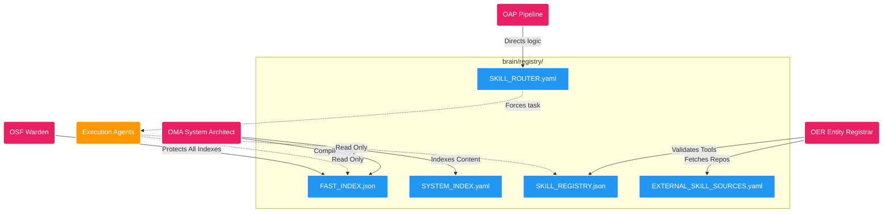

# ==========================================
# OmniClaw V5.0 | Protected by OSF Daemon
# ==========================================

# 🗃️ The Registry Core (OER & OMA Domain)

> [!CAUTION]
> This directory is the **Authoritative Fast Index** of the OmniClaw System. It is strictly maintained by the **OER (Entity Registrar)** and **OMA (System Architect)** Daemons.
> - **Execution Agents:** DO NOT attempt to write or modify JSON/YAML files in this directory. 
> - If an Agent wants to register a new skill or dataset, it MUST submit a formal request to the `OAP Pipeline`. Only OER has the authority to append to `SKILL_REGISTRY.json` or `FAST_INDEX.json`.

## 🗺️ Registry Topology (V5.0)
The absolute routing hierarchy executed by the core daemons.

## Core Mechanisms
- **FAST INDEX:** The hyper-optimized map utilized by OMA to route systemic signals.
- **SKILL REGISTRY:** The exhaustive record of all approved scripts, tools, and actions permitted to run.
- **NO HUMAN LOGS:** This directory is not a log-dump. System transaction logs are strictly banished.
