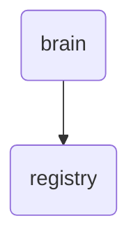

# Registry Identity

The registry directory within OmniClaw v5.0 serves as the central repository for skill definitions, routing configurations, and system metadata, ensuring seamless integration and management of external skill sources.

---

## Topological View

---
*OmniClaw V5.0 | Forged by OMA AI Architect | brain.registry | 2026-04-10*
