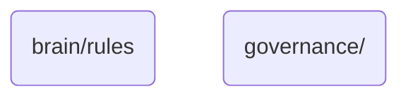

# Rules Identity

This directory manages the overarching governance policies, procedures, and standards that ensure the ethical, legal, and operational integrity of OmniClaw v5.0's AI agents and their interactions within the system.

## Topological View

---
*OmniClaw V5.0 | Forged by AI Architect | Evaluated dynamically*
