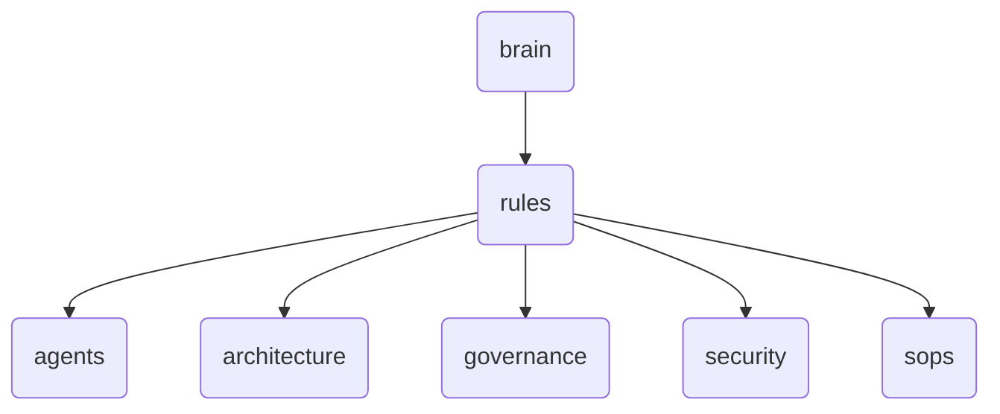

# Rules Identity

The 'rules' directory within OmniClaw v5.0 houses the governance and security policies, as well as architectural guidelines for agents and systems interacting with the brain module.

---

## Topological View

---
*OmniClaw V5.0 | Forged by OMA AI Architect | brain.rules | 2026-04-10*
