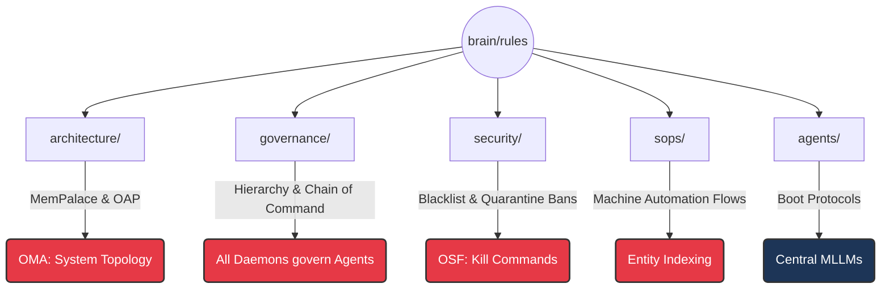

# 🧠 OMNICLAW SUPREME RULES MATRIX 

## 1. Directory Identity & Capacity Profile
This layer contains the **Constitutional DNA** for the OmniClaw V5.0 Operating System.
- **Authority:** Enforced unconditionally by the **8 Core Daemons**.
- **Scope:** Defines execution boundaries, storage paradigms (MemPalace), security blacklists, and Central Agent constraints.
- **Constraint:** ANY Agent attempting to act autonomously MUST implicitly load its respective path from this directory into context before acting. Failure to adhere to these matrices triggers instant OSF contextual termination.

---

## 2. The 5-Pillar Topology Map (Area Graph)

---

## 3. Directory Quadrants

| Quadrant | Enforcer | Purview |
|---|---|---|
| **`architecture/`** | OMA | The physical geometry of the OS. `RULE-ARCH-06` (MemPalace 3-Layer) resides here. |
| **`governance/`** | All Daemons | The Absolute Hierarchy (Daemons > Agents). |
| **`security/`** | OSF | Anti-virus, Blacklists, and Quarantine Execution limits. |
| **`sops/`** | OER | 100% Automated pipelines (e.g. Syncing the Ecosystem via `SKILL_REGISTRY.json`). |
| **`agents/`** | OMA | The Boot Prompts for the massive MLLM brains (Antigravity/Gemini, Cline/Claude) operating as slaves to the Daemons. |

---
*OmniClaw V5.0 | Protected by OSF Daemon | 8-Daemon Master Architecture*
