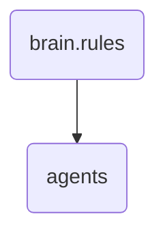

# Agents Identity

This directory contains the rules for managing and interacting with agents within OmniClaw. It ensures consistent behavior across different types of agents.

---

## Topological View

---
*OmniClaw V5.0 | Forged by OMA AI Architect | brain.rules.agents | 2026-04-10*
