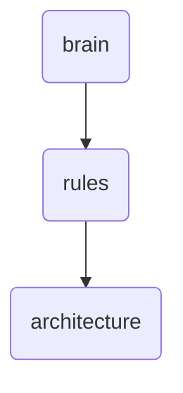

# Architecture Identity

This directory contains the core architectural documents that define the structure and design principles of OmniClaw v5.0, including daemons, filesystem management, language support, auto-evolution mechanisms, memory palace implementation, and OAP pipeline.

---

## Topological View

---
*OmniClaw V5.0 | Forged by OMA AI Architect | brain.rules.architecture | 2026-04-10*
