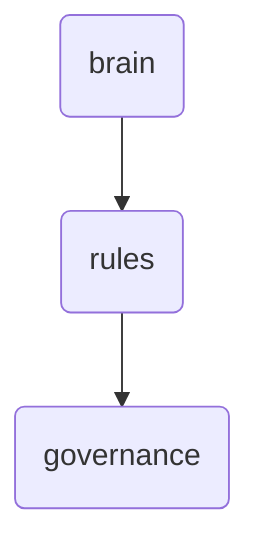

# Governance Identity

This directory houses governance-related rules and policies for OmniClaw v5.0, ensuring ethical and transparent operations.

---

## Topological View

---
*OmniClaw V5.0 | Forged by OMA AI Architect | brain.rules.governance | 2026-04-10*
