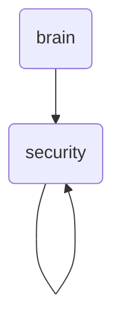

# Security Identity

This directory contains security-related rules and protocols for OmniClaw v5.0, ensuring the system's integrity and protecting against unauthorized access.

---

## Topological View

---
*OmniClaw V5.0 | Forged by OMA AI Architect | brain.rules.security | 2026-04-10*
