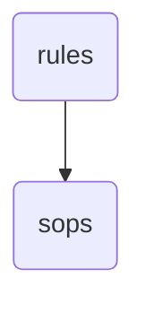

# Sops Identity

The 'sops' directory within OmniClaw v5.0 houses standardized operating procedures and guidelines for various aspects of the system, ensuring consistency and efficiency in operations.

---

## Topological View

---
*OmniClaw V5.0 | Forged by OMA AI Architect | brain.rules.sops | 2026-04-10*
