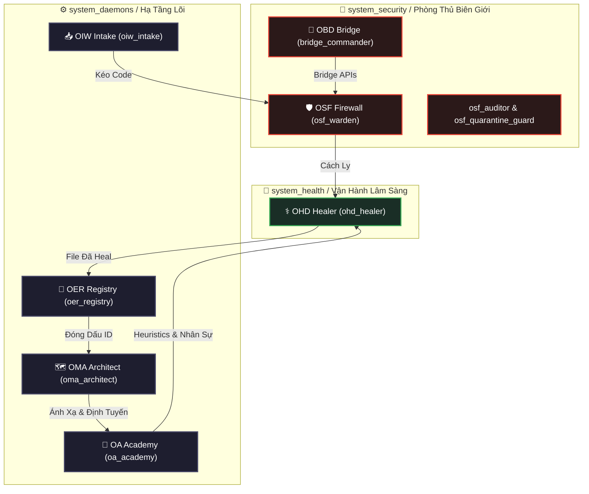

# 🏛️ OER & Core Daemons — Quản Trị Hệ Sinh Thái OmniClaw

> **Thẩm Quyền:** CEO (LongLeo) | **Phiên Bản:** 3.0 | **Ngày:** 2026-04-08
> **Trạng Thái:** ĐANG HOẠT ĐỘNG — Tài liệu này thay thế tất cả định nghĩa thẩm quyền hệ sinh thái trước đây.

[**🇬🇧 View in English**](CORE_DAEMONS_AND_OER.md) | [**Quay về Docs**](../README-vn.md)

Tài liệu này định nghĩa **9 Core Daemon** của OmniClaw OS và **Pipeline Tự Động Zero-Trust** quản trị cách mọi Skill, Plugin, Agent và Workflow gia nhập hệ sinh thái.

---

## 1. Các Trụ Cột Quản Trị (Core Daemons)

Để ngăn lạm quyền và vi phạm Zero-Trust, thẩm quyền hệ sinh thái được phân phối nghiêm ngặt qua 9 Agent chuyên biệt (Daemon) nằm trong 3 phòng ban kiến trúc riêng biệt (`system_daemons`, `system_health`, `system_security`):

| Node ID | Designation | Vai Trò Chung | Phòng Ban |
| :--- | :--- | :--- | :--- |
| **`oiw_intake`** | OmniClaw Intake Worker | Thu Hoạch Viên | `system_daemons` |
| **`osf_warden`** | OmniClaw Sandbox Firewall | Tường Lửa Biên Giới | `system_security` |
| **`osf_auditor`** | OmniClaw Security Auditor | (Sub) Kiểm Toán File | `system_security` |
| **`osf_quarantine_guard`** | OmniClaw Quarantine Guard | (Sub) Cai Ngục | `system_security` |
| **`ohd_healer`** | OmniClaw Health Daemon | Bác Sĩ Hệ Thống | `system_health` |
| **`oa_academy`** | OmniClaw Academy | Kiểm Toán Thực Thi | `system_daemons` |
| **`oer_registry`** | OmniClaw Ecosystem Registry | Quản Lý Đăng Ký | `system_daemons` |
| **`oma_architect`** | OmniClaw Map Architect | Cấu Hình Hạ Tầng | `system_daemons` |
| **`obd_harbor`** | OmniClaw Bridge Daemon | Harbor Master | `system_daemons` |

> **Lưu ý:** OSF Warden có 2 sub-daemon (`osf_auditor` + `osf_quarantine_guard`) — tổng cộng **9 node** trong 3 phòng ban.

---

## 2. Ma Trận Thẩm Quyền (Ai Làm Gì)

| Chức Năng | OIW | OSF | OHD | OA | OER | OMA | OBD |
|---|:---:|:---:|:---:|:---:|:---:|:---:|:---:|
| Git Clone / Thu Hoạch | ✅ | ❌ | ❌ | ❌ | ❌ | ❌ | ❌ |
| Kiểm Tra Cách Ly (Biên Giới) | ❌ | ✅ | ❌ | ❌ | ❌ | ❌ | ❌ |
| Sửa File (Lint/Auto-Heal) | ❌ | ❌ | ✅ | ❌ | ❌ | ❌ | ❌ |
| Kiểm Toán Logic & Tuyển Dụng | ❌ | ❌ | ❌ | ✅ | ❌ | ❌ | ❌ |
| Cập Nhật `SKILL_REGISTRY.json` | ❌ | ❌ | ❌ | ❌ | ✅ | ❌ | ❌ |
| Ánh Xạ Node & Nhận Dạng | ❌ | ❌ | ❌ | ❌ | ❌ | ✅ | ❌ |
| Chạy Subprocess/Terminal | ❌ | ❌ | ❌ | ❌ | ❌ | ❌ | ✅ |

> [!CAUTION]
> **Phân Khoang Zero-Trust**: Tất cả 9 Daemon là node agent đã đăng ký đầy đủ với file skill bị hạn chế. Nếu bất kỳ daemon nào cố thực thi script ngoài ranh giới `SKILL.md` của nó, Orchestrator sẽ lập tức chấm dứt instance đó.

---

## 3. Sơ Đồ Phân Cấp OAP Tự Trị

---

*OER & Core Daemons v3.0 — OmniClaw Corp — 2026-04-08*
