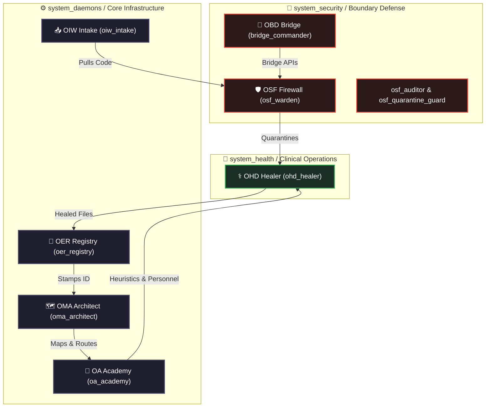

# 🏛️ OER & Core Daemons — OmniClaw Ecosystem Governance

> **Authority:** CEO (LongLeo) | **Version:** 3.0 | **Date:** 2026-04-08
> **Status:** ACTIVE — This document supersedes all previous ecosystem authority definitions.

[**Back to Docs**](../../../README.md)

This document defines the **7 Core Daemons** of OmniClaw OS and the **Zero-Trust Automated Pipeline** that governs how every Skill, Plugin, Agent, and Workflow enters the ecosystem.

---

## 1. The 7 Pillars of Governance (Core Daemons)

To prevent scope overreach and Zero-Trust violations, ecosystem authority is strictly distributed across 7 specialized Agents (Daemons) housed strictly within 3 distinct architectural departments (`system_daemons`, `system_health`, `system_security`):

| Node ID | Designation | General Role | Department |
| :--- | :--- | :--- | :--- |
| **`oiw_intake`** | OmniClaw Intake Worker | Harvester | `system_daemons` |
| **`osf_warden`** | OmniClaw Sandbox Firewall | Border Firewall | `system_security` |
| **`ohd_healer`** | OmniClaw Health Daemon | System Doctor | `system_health` |
| **`oa_academy`** | OmniClaw Academy | Execution Auditor | `system_daemons` |
| **`oer_registry`**| OmniClaw Ecosystem Registry | Registrar | `system_daemons` |
| **`oma_architect`**| OmniClaw Map Architect | Infrastructure Config | `system_daemons` |
| **`obd_harbor`** | OmniClaw Bridge Daemon | Harbor Master | `system_daemons` |

---

## 2. Authority Matrix (Who Does What)

| Function | OIW | OSF | OHD | OA | OER | OMA | OBD |
|---|:---:|:---:|:---:|:---:|:---:|:---:|:---:|
| Git Clone / Harvest | ✅ | ❌ | ❌ | ❌ | ❌ | ❌ | ❌ |
| Quarantine Check (Border) | ❌ | ✅ | ❌ | ❌ | ❌ | ❌ | ❌ |
| Fix Files (Lint/Auto-Heal) | ❌ | ❌ | ✅ | ❌ | ❌ | ❌ | ❌ |
| Audit Logic & Recruit Agents | ❌ | ❌ | ❌ | ✅ | ❌ | ❌ | ❌ |
| Update `SKILL_REGISTRY.json` | ❌ | ❌ | ❌ | ❌ | ✅ | ❌ | ❌ |
| Map Node Paths & Identities | ❌ | ❌ | ❌ | ❌ | ❌ | ✅ | ❌ |
| Run Subprocess/Terminals | ❌ | ❌ | ❌ | ❌ | ❌ | ❌ | ✅ |

> [!CAUTION]
> **Zero-Trust Compartmentalization**: All 7 Daemons are fully registered agent nodes with restricted skill files. If any daemon attempts to execute a script outside its `SKILL.md` boundaries, the Orchestrator will instantly terminate the instance.

---

## 3. The Autonomous OAP Hierarchy

---

*OER & Core Daemons v3.0 — OmniClaw Corp — 2026-04-08*
