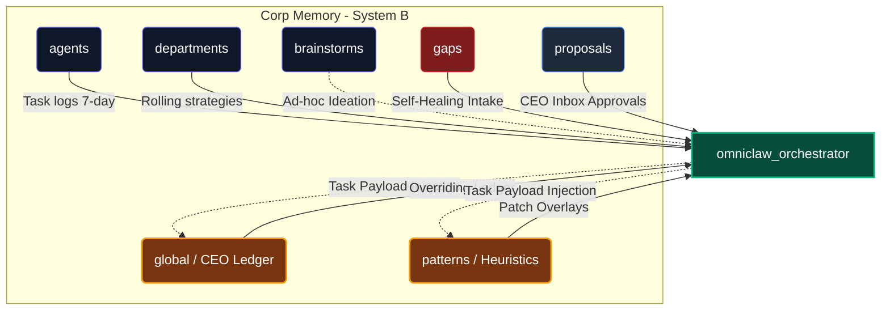

## Complete Knowledge Reference for All Agents, Depts, Workflows, Rules, and Memory

> **READ THIS FIRST.** Any new AI loaded into the system must read this file.
> This is the master map of the entire OmniClaw Corp.

---

## 1. IDENTITY & SOUL

| Field | Value |
|-------|-------|
| Name | OmniClaw Corp |
| Version | v2.4 (Cycle 7) |
| CEO | LongLeo |
| Soul | `OmniClaw/SOUL.md` |
| Governance | `OmniClaw/GOVERNANCE.md` |
| Thesis | `OmniClaw/THESIS.md` (40 pillars) |

**What is OmniClaw Corp?**
A multi-agent AI system organized as a real corporation.
It features a CEO, C-Suite, 21 departments, 75+ agents, complete workflows, memory, gates, and self-operating procedures.

---

## 2. ORGANIZATIONAL STRUCTURE

### Authority Tiers
```
Tier 1: CEO (LongLeo) €” final authority on all decisions
Tier 2: C-Suite (CTO, CMO, COO, CFO, CSO, CIO) €” strategic execution
Tier 3: Dept Heads €” dept-level management
Tier 4: Workers €” task execution
```

### 21 Departments

| # | Dept ID | Head Agent | Gate | Reports To |
|---|---------|-----------|------|------------|
| 1 | engineering | backend-architect-agent | GATE_QA (output) | CTO |
| 2 | qa_testing | test-manager-agent | IS GATE_QA | CTO |
| 3 | it_infra | it-manager-agent | €” | COO |
| 4 | marketing | growth-agent | GATE_CONTENT (output) | CMO |
| 5 | support | channel-agent | GATE_CONTENT (output) | COO |
| 6 | content_review | editor-agent | IS GATE_CONTENT | CMO |
| 7 | operations | scrum-master-agent | €” | COO |
| 8 | hr_people | hr-manager-agent | €” | COO |
| 9 | security_grc | strix-agent | IS GATE_SECURITY | CSO |
| 10 | finance | cost-manager-agent | €” | CFO |
| 11 | strategy | product-manager-agent | €” | CSO |
| 12 | legal | legal-agent | IS GATE_LEGAL | CSO |
| 13 | rd | rd-lead-agent | €” | CTO |
| 14 | registry_capability | registry-manager-agent | €” | CTO |
| 15 | asset_library | library-manager-agent | €” | CIO |
| 16 | od_learning | org-architect-agent | €” | CSO |
| 17 | planning_pmo | pmo-agent | €” | COO |
| 18 | monitoring_inspection | monitor-chief-agent | €” | COO |
| 19 | system_health | health-chief-agent | €” | CTO |
| 20 | content_intake | intake-chief-agent | IS GATE_CIV | CTO |
| 21 | client_reception | project-intake-agent | €” | COO (DORMANT) |

**Source of truth:** `corp/org_chart.yaml`

---

## 3. GATE SYSTEM (4 Gates)

| Gate | Owner | Blocks | Trigger |
|------|-------|--------|---------|
| GATE_QA | qa_testing (test-manager-agent) | Engineering output going to prod | Auto after engineering task |
| GATE_CONTENT | content_review (editor-agent) | Marketing/Support public output | Before any publish |
| GATE_SECURITY | security_grc (strix-agent) | External plugins/repos/skills | On any external ingest |
| GATE_LEGAL | legal (legal-agent) | Contracts, partnerships, data sharing | On any legal document |

**Gate PASS = PASS + receipt in `telemetry/receipts/gate_<name>/`**
**Gate FAIL = content blocked, submitter notified, must revise**

---

## 4. WORKFLOWS (Key Pipelines)

| Workflow | File | Trigger | Phases |
|----------|------|---------|--------|
| Corp Daily Cycle | `ops/workflows/corp-daily-cycle.md` | `omniclaw corp start` | 7 phases |
| Knowledge Ingest | `ops/workflows/knowledge-ingest.md` | `omniclaw ingest <source>` | 7 phases |
| Agent Auto-Create | `ops/workflows/agent-auto-create.md` | Phase 5b of knowledge-ingest | 7 phases |
| Corp Learning Loop | `ops/workflows/corp-learning-loop.md` | `omniclaw corp retro` | auto |
| Delivery Pipeline | `corp/sops/DELIVERY_PIPELINE.md` | Client accepts proposal | 6 phases |

### Corp Daily Cycle (7 phases)
```
Phase 1: CEO Brief †’ reads mission, KPIs, escalations, proposals
Phase 2: C-Suite Dispatch †’ strategy †’ dept goals †’ blackboard.json
Phase 3: Dept Dispatch †’ 21 dept heads assign tasks to workers
Phase 4: Execute †’ workers execute, write receipt
Phase 5: Gate †’ GATE_QA / GATE_CONTENT / GATE_SECURITY / GATE_LEGAL
Phase 6: Brief Back †’ dept heads write daily_briefs
Phase 7: Reflect †’ cognitive_reflector †’ proposals †’ CEO
```

### Knowledge Ingest (7 phases)
```
Phase 1: Intake (intake-chief-agent) †’ create ticket KI-<timestamp>
Phase 2: Security Scan (strix-agent) †’ GATE pass or reject
Phase 3: Classify (knowledge_navigator) †’ domain tags + relevant_agents
  †’ †’Agent matching: org_chart + AGENTS.md + SKILL_REGISTRY.json
  †’ Gap detected if relevant_agents=[] + type=TOOL|RESEARCH †’ Phase 5b
Phase 4: Enrich (knowledge_enricher) †’ metadata, cross-links, KI format
Phase 5a: Agent exists †’ link to agent memory
Phase 5b: No agent †’ trigger agent-auto-create.md
Phase 6: Archive (archivist) †’ brain/knowledge/<domain>/
Phase 7: Notify CEO †’ if TOOL/RESEARCH or new agent created
```

### Agent Auto-Create (7 phases)
```
Phase 1: Validate gap (cognitive_reflector)
Phase 2: Design spec (product-manager-agent) †’ brain/agents/proposals/
Phase 3: Security review (strix-agent)
Phase 4: CEO Proposal (B5 format) †’ PAUSE for approval
Phase 5a: Register (hr-manager-agent) †’ AGENT.md + memory file + receipt
Phase 5b: New dept? †’ MANAGER_PROMPT, WORKER_PROMPT, rules.md, dept memory, daily brief, org_chart.yaml, kpi_targets.yaml, kpi_scoreboard.json
Phase 6: Link (org-architect-agent) †’ org_chart.yaml, AGENTS.md, daily_briefs
Phase 7: Activate skills (registry-manager-agent) †’ SKILL_REGISTRY.json
†’ MASTER CHECKLIST at end of agent-auto-create.md
```

---

## 5. MEMORY ARCHITECTURE (V5.0 Structural Logic)



| Layer | Path | Owner | Retention | Content |
|-------|------|-------|-----------|---------|
| L1 Knowledge Base | `brain/knowledge/` | library agent | PERMANENT | Research, KIs, FAQs (72+ files) |
| L2 Global | `brain/memory/system_memory/global/` | CEO | PERMANENT | Strategic overriding decisions |
| L3 Patterns | `brain/memory/system_memory/patterns/` | Agents | PERMANENT | Agent-written heuristic hotfixes |
| L4 Dept | `brain/memory/system_memory/departments/` | Dept head | 30-day rolling | Sprint lessons, patterns |
| L5 Agent | `brain/memory/system_memory/agents/` | Agent | 7-day rolling | Task context, outcomes |
| Inbox / Queues | `gaps/` & `proposals/` | Orchestrator | Volatile | Self-healing targets & CEO unread inbox |

**Spec:** `brain/memory/system_memory/memory_spec.md` (v5.0)

### Key Knowledge Files
| File | Purpose |
|------|---------|
| `brain/knowledge/knowledge_index.md` | Master index of all KIs |
| `brain/memory/system_memory/global/global_ceo_ledger.md` | Single point of truth for AI behavior |
| `brain/memory/system_memory/patterns/system_heuristics.md` | Hotfix registry for agent AI bugs |
| `brain/knowledge/rd_research_log.md` | R&D research tracking |

---

## 6. AGENT ROSTER (Key Agents)

### C-Suite
| Agent | Role | Dept |
|-------|------|------|
| orchestrator_pro | CEO proxy (when CEO offline) | €” |
| backend-architect-agent | CTO / Eng Lead | engineering |
| growth-agent | CMO | marketing |
| scrum-master-agent | COO | operations |
| cost-manager-agent | CFO | finance |
| product-manager-agent | CSO | strategy |
| library-manager-agent | CIO | asset_library |

### Key Specialist Agents
| Agent | Specialty | Dept |
|-------|-----------|------|
| notebooklm-agent (Nova) | Research Intelligence / ALL data intake | rd |
| strix-agent | Security / GATE_SECURITY | security_grc |
| cognitive_reflector | Pattern analysis / learning loop | strategy |
| knowledge_navigator | Classification / domain matching | asset_library |
| knowledge_enricher | Metadata / cross-linking | asset_library |
| archivist | Memory rotation / archival | operations |
| notification_bridge | CEO alerts via Telegram | operations |

**Full roster:** `brain/indices/FAST_AGENT_INDEX.json`
**AGENT.md files:** `brain/agents/<agent-id>/AGENT.md` (23 files)

---

## 7. SKILL ARCHITECTURE

**Registry:** `brain/registry/SKILL_REGISTRY.json` (103+ skills)
**Skill folders:** `ecosystem/skills/` (45 folders)
**Tiers:** `brain/registry/SKILL_TIERS.md`
**Spec:** `ecosystem/skills/SKILL_SPEC.md`

### Core Skills (loaded by most agents)
```
reasoning_engine     €” complex analysis and decision making
context_manager      €” session and memory context handling
knowledge_enricher   €” metadata and cross-link enrichment
knowledge_navigator  €” domain classification and routing
diagnostics_engine   €” system and performance diagnostics
resilience_engine    €” error recovery and retry logic
shell_assistant      €” terminal and script execution
notification_bridge  €” Telegram/Discord alert routing
```

---

## 8. SHARED STATE FILES

| File | Purpose | Updated by |
|------|---------|------------|
| `brain/memory/blackboard.json` | Task queue, cycle state, open items | scrum-master-agent |
| `brain/memory/system_memory/kpi_scoreboard.json` | Live KPI status all 21 depts | monitor-chief-agent |
| `brain/memory/system_memory/escalations.md` | L1/L2/L3 open escalations | any agent |
| `brain/memory/system_memory/proposals/` | Pending CEO decisions | strategy dept |
| `brain/memory/system_memory/daily_briefs/<dept>.md` | Last dept brief | dept head |
| `brain/memory/roadmap.md` | Strategic milestones | pmo-agent |
| `brain/memory/sources.yaml` | Data collector source list | data-collector-agent |
| `corp/kpi_targets.yaml` | KPI targets all 21 depts | strategy |

---

## 9. FILE PATH RULES

```
œ… VALID €” OmniClaw workspace:
  corp/           †’ org structure, prompts, memory, rules
  brain/          †’ knowledge, agents, skills, registry, memory, shared-context
  ops/            †’ workflows, scripts, infra
  tools/clawtask/ †’ task management API (port 7474)
  plugins/        †’ external tools, MCPs, integrations
  telemetry/      †’ receipts, logs, monitoring

🔒 SYSTEM €” do not modify (without explicit CEO order):
  $USERPROFILE/.gemini/  †’ Antigravity brain/memory
  $USERPROFILE/.claude/  †’ Claude Code data
  $USERPROFILE/.nullclaw/ †’ NullClaw data

Œ NEVER create project files in:
  Desktop, Documents, Temp, or any path outside OmniClaw workspace
```

**Source: RULE-STORAGE-01, RULE-DYNAMIC-01 in GOVERNANCE.md**

---

## 10. BOOT SEQUENCE

Every session an AI should:
```
Step 1: Read SOUL.md
Step 2: Read GOVERNANCE.md
Step 3: Read THESIS.md (40 pillars)
Step 4: Read AGENTS.md (roster)
Step 5: Read brain/memory/blackboard.json
Step 6: Check corp/memory/global/decisions_log.md (last 5 CEO decisions)
Step 7: Read own AGENT.md from brain/agents/<agent-id>/AGENT.md
Step 8: Read dept MANAGER_PROMPT.md or WORKER_PROMPT.md
Step 9: Check KPI targets in corp/kpi_targets.yaml for own dept
Step 10: Begin corp cycle or await CEO instruction
```

Source: `GEMINI.md` and `CLAUDE.md` (both carry full boot sequence)

---

## 11. ESCALATION PROTOCOL

| Level | Trigger | Target | Channel |
|-------|---------|--------|---------|
| L1 | Dept-level blocker | Dept Head †’ C-Suite | blackboard.json flag |
| L2 | Cross-dept or P2 incident | COO/CTO | escalations.md + Telegram |
| L3 | Critical / P1 / CEO-required | CEO directly | Telegram (nullclaw) |

```
2-Strike Rule: Agent fails same task twice †’ set handoff_trigger: BLOCKED
†’ escalate to Antigravity/dept head immediately
†’ Do NOT retry after 2 failures. Stop and report.
```

---

## 12. EXTERNAL INTEGRATION (Layer 2 Services)

| Service | Port | Purpose | Start |
|---------|------|---------|-------|
| ClawTask API | 7474 | Task dashboard + agent orchestration | `python clawtask_api.py` |
| Nullclaw (Telegram bot) | €” | CEO telegram gateway | `start_nullclaw.ps1` |
| open-notebook | 8502/5055 | Local RAG for Nova | Docker |
| SurrealDB | 8000 | open-notebook backend | Docker |
| MCP Cluster | various | Tool extensions | Auto |

**Config:** `tools/clawtask/.env` (master secrets)
**Secrets registry:** `SECRETS_REGISTRY.md`

---


| Domain Tag | Primary Dept | Secondary Dept |
|-----------|-------------|----------------|
| web_frontend, backend, devops, sre, mobile | engineering | rd |
| qa, testing, coverage, e2e | qa_testing | engineering |
| server, network, database, infra | it_infra | engineering |
| seo, social, content, campaign | marketing | content_review |
| support, faq, crm, customer | support | marketing |
| editorial, fact-check, brand-voice | content_review | marketing |
| sprint, ops, automation, archive | operations | planning_pmo |
| agent, onboard, performance, hr | hr_people | od_learning |
| security, cve, pentest, gdpr, compliance | security_grc | legal |
| budget, cost, invoice, api_cost | finance | strategy |
| okr, roadmap, market, proposal | strategy | rd |
| contract, ip, legal, license | legal | security_grc |
| research, paper, model, rag, graph | rd | asset_library |
| skill, plugin, registry, tool | registry_capability | rd |
| knowledge, ki, memory, index | asset_library | rd |
| org, learning, training, upgrade | od_learning | hr_people |
| capacity, milestone, planning, pmo | planning_pmo | operations |
| monitoring, sla, inspection, kpi | monitoring_inspection | system_health |
| health, diagnostic, recovery, agent-health | system_health | monitoring_inspection |
| intake, vetting, quarantine, civ | content_intake | security_grc |
| client, proposal, reception, project | client_reception | support |

---

## 14. RECEIPT FORMAT (Standard for All Agents)

Every completed task writes a receipt to `telemetry/receipts/<dept>/<task_id>_receipt.json`:
```json
{
  "task_id": "<task_id>",
  "agent_id": "<agent_id>",
  "dept": "<dept_name>",
  "task_description": "<what was done>",
  "status": "COMPLETE | PARTIAL | FAILED",
  "started_at": "<ISO8601>",
  "completed_at": "<ISO8601>",
  "gate_required": "<gate_name or null>",
  "gate_status": "PASS | FAIL | N/A",
  "output_path": "<where output was saved>",
  "lessons_learned": "<1 sentence>",
  "<dept_specific_fields>": "..."
}
```

---

## 15. QUICK REFERENCE COMMANDS

| Command | Action |
|---------|--------|
| `omniclaw corp start` | Begin daily corp cycle |
| `omniclaw corp retro` | Run learning loop / retro |
| `omniclaw ingest url <url>` | Ingest web URL into knowledge base |
| `omniclaw ingest repo <url>` | Ingest GitHub repo |
| `omniclaw ingest file <path>` | Ingest local file |
| `omniclaw ingest text "<content>"` | Ingest raw text |
| `omniclaw ingest search "<query>"` | Web search + ingest |
| `approve agent <id>` | CEO approves new agent proposal |
| `reject agent <id>` | CEO rejects new agent proposal |

---

*OmniClaw Corp €” System Map v1.0 €” 2026-03-22*
*Last updated: Cycle 7 system audit*
*Read on boot. Update when system structure changes.*


