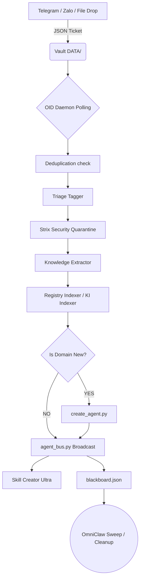

# OmniClaw Ingestion Daemon (OID) V2.5

> **Status:** ACTIVE
> **Layer:** System Automation (Daemon)
> **Owner:** `registry-manager-agent` & `intake-chief-agent`

## 1. Overview & Mission

The **OmniClaw Ingestion Daemon (OID)** is the central data intake nervous system of OmniClaw. It replaces fragmented, manual scripts with a robust, fully autonomous **8-Phase Pipeline**. 

OID acts as a continuously running daemon (`omniclaw_oid_daemon.py`). It monitors specific vault directories for new knowledge "tickets", ingests the referenced content (URLs, GitHub Repos, Documents), secures the data, extracts knowledge, maps it to the OmniClaw registries, and triggers the **Auto-Evolution** of the workforce (spawning new Agents and Skills).

**Key Capabilities:**
- **Zero-Trust Security:** All incoming data is quarantined and vetted by Strix before entering the core memory.
- **Zero-Token Overhead:** Routing, deduplication, and initial classification are handled via local deterministic scripts (no LLM required) to save costs.
- **Auto-Evolution:** Dynamically spawns new Head Agents (`create_agent.py`) and triggers Meta-Skills (`Skill Creator Ultra`) if incoming data belongs to a completely novel domain.

---

## 2. The 8-Phase Architecture Pipeline

When a new ticket lands in `storage/vault/DATA/`, the daemon executes the following sequence:

### ⚙️ Phase 1: Polling & Queuing
- The daemon continuously polls `storage/vault/DATA/` for matching `KI-*.json` files.
- Files are parsed securely. Invalid JSONs are moved to a `FAILED` directory.

### 🔁 Queue Resiliency & Round-Robin Retries
The `omniclaw_oid_daemon.py` utilizes a **Round-Robin Retry Mechanism** to prevent bottlenecking:
- Tickets are processed sequentially from index `0` of the `ACCEPTED_Q`.
- If an extraction fails (e.g., due to a network drop or target server timeout), the ticket is **NOT** immediately retried.
- Instead, the `retry_count` is incremented, and the ticket is pushed to the **BACK** of the queue (`queue.append`).
- This allows the daemon to continue processing ticket `#501` without being blocked by a faulty ticket `#500`.
- The daemon will revisit the failed ticket on the next loop. After `MAX_RETRIES = 3`, the ticket is permanently moved to the `REJECTED_Q` for manual review.

### 🛡️ Phase 2: Deduplication
- MD5 hashing of the source URL/Repo ensures the same data is not ingested twice.
- Duplicate detection immediately halts the process to prevent bloat.

### 🛂 Phase 3: Fast Triage
- Pattern matching (`system/automations/daemons/oid/triage.py`) assigns a basic Domain/Category to the source without invoking LLMs. 
- Output examples: `ai_ml`, `frontend`, `marketing`, `security`.

### 🚨 Phase 4: Strix Security Vetting
- The daemon invokes native Pwsh scripts (`system/security/QUARANTINE/vet_repo.ps1`) to sandbox and scan the repository.
- **Rules:** Vetted code goes to `vetted/repos/`; malicious code is permanently locked in `QUARANTINE/isolation/`.

### 🧠 Phase 5: Knowledge Extraction & Heavy-Duty Scraper
OID executes progressively aggressive fetching strategies to ensure 100% extraction success before resorting to retries:
- **Strategy 1:** Shallow Native Git Clone (Fastest)
- **Strategy 2:** Full Native Git Clone (Bypasses shallow limitations)
- **Strategy 3:** Heavy-Duty Github API Zipball (Bypasses Git port/IP blocks entirely by downloading source code as a ZIP proxy via Github REST API)
- High-value code, Markdown, and documentation are extracted robustly. Ignored: Bloatware (`node_modules`, `venv`, binary files).

### 🗂️ Phase 6: Core Mapping & Registration
- OID acts as the supreme librarian by executing two critical mappers:
  1. `registry_indexer.py`: Adds the new Repositories and Auto-Evolved Agents to `system/registry/SYSTEM_INDEX.yaml`.
  2. `ki_indexer.py`: Appends the new knowledge artifacts into the universal Central Graph (`brain/knowledge/KI_INDEX.md`).

### 🧬 Phase 7: Auto-Evolution (Agent Genesis)
- If the identified Domain (Phase 3) is completely new to the organization, OID triggers Agent Scaffolding.
- Executes `system/ops/scripts/create_agent.py` to spawn a new Tier-3 Head Agent tailored for that exact domain.

### 📡 Phase 8: Real-Time Ecosystem Broadcast (The "Ping")
- Pushes dynamic integer stats to the CEO's Master Dashboard via `blackboard.json`.
- Dispatches dual SQLite alerts to `agent_bus.py`:
  1. `oid_knowledge_ingested`: Wakes up all context-aware reading agents.
  2. `skill_discovery_required`: Triggers the **Skill Creator Ultra** pipeline (owned by `registry-manager-agent`) to autonomously code a new `.skill` file from the freshly ingested repository.

### 🧹 Phase 9: Sanitation (Cleanup Crew)
- Triggers `omniclaw_cleanup_crew.py` to sweep temporary `.json` tickets, dangling `.git` clones, and intermediate staging files to keep the OS pristine.

---

## 3. Quickstart Tutorial

### How to Run the OID Daemon
In your terminal, start the daemon processes:

```powershell
# Ensure OMNICLAW_ROOT is defined
$env:OMNICLAW_ROOT = "D:\LongLeo\OmniClaw CORP\OmniClaw"

# Launch the Daemon
python system/automations/daemons/omniclaw_oid_daemon.py
```

*Note: In production, this daemon should be running persistently inside a tmux/screen session or registered as a Windows Service/Task Scheduler.*

### How to Trigger an Ingestion (Method 1: File Drop)
1. Create a JSON ticket file: `storage/vault/DATA/KI-TEST-001.json`
2. Populate the ticket:
```json
{
  "id": "TICKET-999",
  "source": "https://github.com/example/awesome-python-plugin",
  "triage": {
    "domain": "backend_engineering"
  }
}
```
3. Watch the OID logs in your terminal. You will see the 8-Phase pipeline execute flawlessly in real-time.

### How to Trigger an Ingestion (Method 2: Telegram Bot)
1. Send a link containing a GitHub shortcode or URL to the OmniClaw Telecom Bot.
2. The `telegram_dispatch.py` channel will automatically format the ticket and drop it into `storage/vault/DATA/`, triggering the OID daemon automatically.

---

## 4. Maintenance & Operations

- **Log File Location:** `system/automations/daemons/logs/oid_daemon.log`
- **Hash Database:** `system/automations/daemons/oid/processed_hashes.json` (Delete a hash here if you wish to forcefully re-ingest a previously scanned URL).
- **Error Handling:** Any ticket that catastrophically fails during parsing is moved to `storage/vault/DATA/FAILED/`.

## 5. Architectural Diagram



> *Documentation generated by Antigravity | OmniClaw V3.1*

