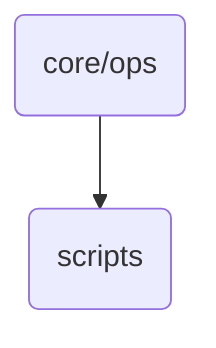

# Core Operations Scripts

This directory contains standalone operational scripts, automation utilities, and maintenance bots (like `oma_ai_identities.py`) utilized by Daemons and administrators to maintain the OmniClaw ecosystem.

## Topological View

---
*OmniClaw V5.0 | Protected by OSF Daemon*
