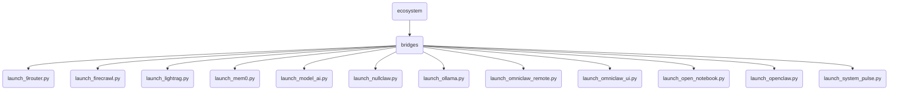

# Bridges Identity

Launch scripts and dynamic bridges acting as the strict perimeter firewall connecting OmniClaw core OBD Harbor to designated AI architectures, external MCP pipelines, and UI/Remote interfaces.

---

## Chức Năng (Tiếng Việt)

Cổng gác (Bridge) và các kịch bản đánh thức (Launcher) được quản lý độc quyền bởi mỏ neo OBD (OBD Harbor). Các bridge này đóng vai trò cách ly cổng mạng, đảm bảo không có kết nối nào có thể vượt rào kết nối thẳng vào hệ sinh thái OmniClaw khi chưa được cấp phép (mở cảng) từ OBD.

## Topological View

---
*OmniClaw V5.0 | Forged by OMA AI Architect | ecosystem.bridges | 2026-04-11*
