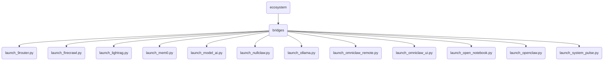

# Bridges Identity

Launch scripts and dynamic bridges acting as the strict perimeter firewall connecting OmniClaw core OBD Harbor to designated AI architectures, external MCP pipelines, and UI/Remote interfaces.

---

## Core Function

Launch scripts acting as gateways managed exclusively by the OBD Harbor. These bridges enforce port isolation and ensure no external connections can bypass the OBD perimeter without explicit authorization.

## Topological View

---
*OmniClaw V5.0 | Forged by OMA AI Architect | ecosystem.bridges | 2026-04-11*
