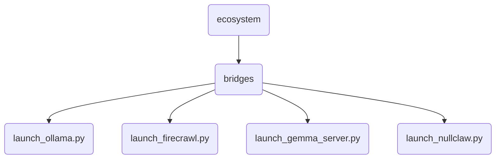

# Bridges Identity

Launch scripts and integration bridges connecting OmniClaw core to external AI architectures (Ollama, HuggingFace, Docker plugins, distributed agents).

---

## Chức Năng (Tiếng Việt)

Cầu nối giao tiếp và các script khởi động hệ thống AI vệ tinh (Ollama, FireCrawl, Gemma Server) để cung cấp API cho Lõi OmniClaw hoạt động.

## Topological View

---
*OmniClaw V5.0 | Forged by OMA AI Architect | ecosystem.bridges | 2026-04-11*
